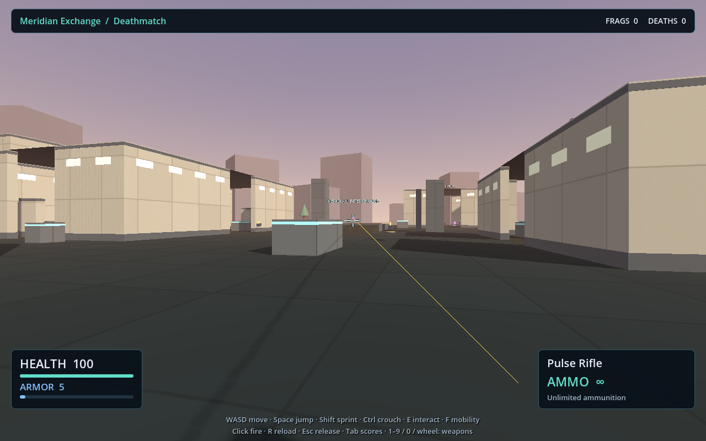
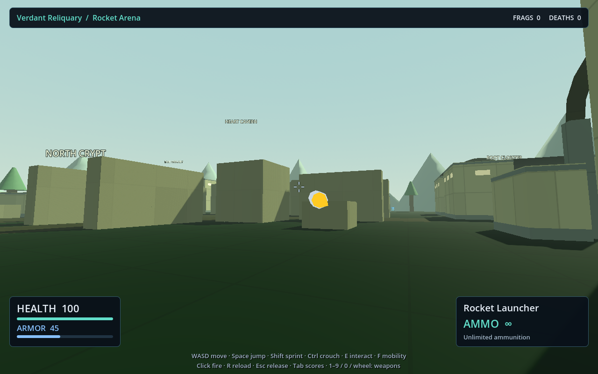
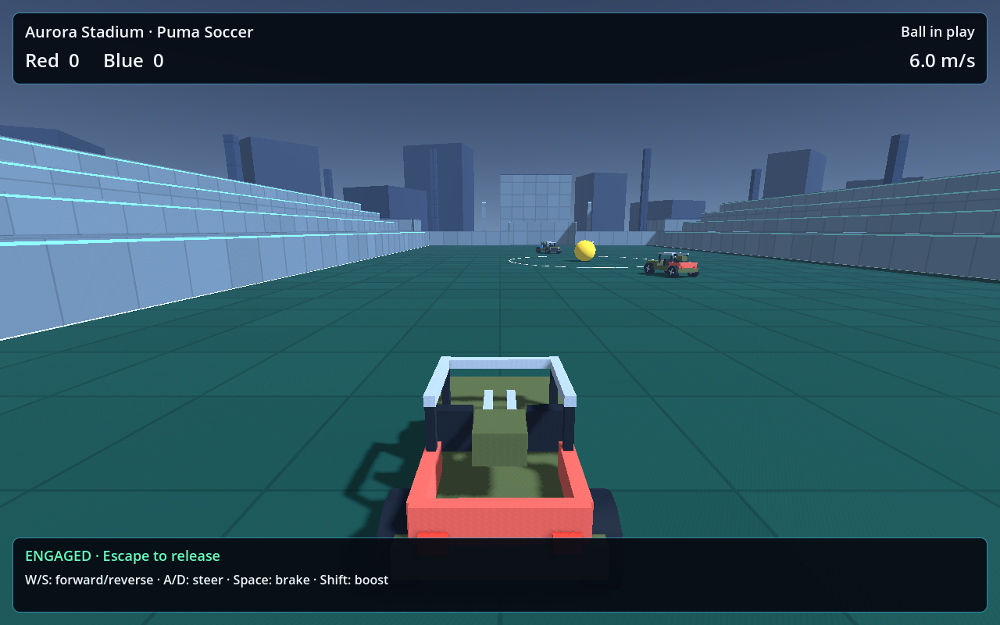
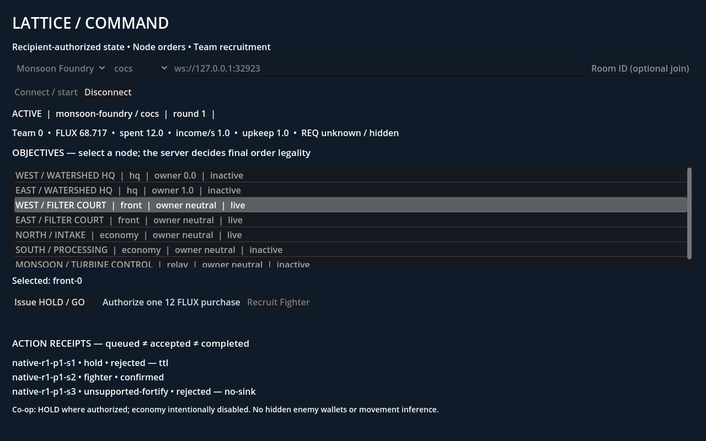

# COCS: DESTINATIONS — Godot Port

A native **Godot 4** port of [COCS](https://github.com/mojomast/cocs), a procedural
arena shooter featuring AI-inspired operators, competitive combat, vehicle
sports and LATTICE strategy modes.

Godot handles the native client, controls, world presentation, HUD and audio.
The original **Node.js simulation remains authoritative** over movement,
weapons, damage, objectives and match rules. The goal is a good Godot-native
game that preserves all nine DESTINATIONS maps and their gameplay identity.

**Status: actively developed, playable prototype.** Combat is available through
the native setup menu; sports and LATTICE currently have separate demo launchers.
This repository includes the original source and development history so the
simulation lock and verification evidence remain reproducible.

[Getting started](#getting-started) · [Current features](#current-features) ·
[Controls](#controls) · [Verification](#verification) ·
[Detailed release matrix](port/RELEASE_MATRIX.md)



## Current features

| Area | Available now |
|---|---|
| Arena combat | Meridian Exchange, Verdant Reliquary and Ember Crucible; Deathmatch, Team Deathmatch, Instagib and Rocket Arena |
| Native presentation | All nine map environments, operator and pickup models, skies, lighting and landmarks |
| Combat feedback | Reticle, confirmed-hit and damage indicators, source-driven projectiles and explosion flashes, procedural sound cues |
| HUD and controls | Health/armor bars, named weapon/ammo display, number-key and wheel weapon selection, team scores and results scoreboard |
| Puma sports demos | Ion Speedway racing and Aurora Stadium soccer: authoritative driving, compact sports HUD and wall-aware chase camera |
| LATTICE command demo | Asterion Relay and Monsoon Foundry: objective selection, recipient-authorized resources, HOLD orders and PvP Fighter recruitment with explicit action receipts |
| Session handling | Local server launcher, host setup, guest transport, stale-state handling, focus release, death/respawn and round-boundary control resets |

The sports demos have bounded driving acceptance; completed laps, scored goals
and sports results/restart remain work in progress. LATTICE is currently a
standalone command board, with co-op orders but no co-op economy or native world
interaction. CTF/Payload and broader mode integration are under development.
See the [release matrix](port/RELEASE_MATRIX.md) for evidence and remaining work.

<details>
<summary>More native screenshots</summary>

**Rocket Arena**



**Puma Soccer — compact HUD and near-wall camera**



**LATTICE command board**



These are native-client captures from real source-server sessions. They represent
the revisions described in their accompanying evidence directories.

</details>

## Getting started

### Requirements

- **Godot 4.5.2 stable**, standard build. The launcher checks the pinned version:
  `4.5.2.stable.official.6ce3de25a`.
- **Node.js 22.13+** and npm.
- **Python 3** for the verifier and sports launcher.
- Git, including repository history for source/provenance checks.

The documented workflow is tested on Linux with Godot's Compatibility renderer.
Graphical automation additionally uses Xvfb; normal play uses your desktop.

```sh
git clone https://github.com/mojomast/cocs-godot.git
cd cocs-godot
npm ci

# Use an absolute path to your Godot 4.5.2 executable.
export GODOT_BIN=/absolute/path/to/Godot_v4.5.2-stable_linux.x86_64
export GUEST_NODE_MODULES="$PWD/node_modules"

# Development helpers use this directory for isolated temporary projects.
mkdir -p /tmp/opencode
export TMPDIR=/tmp/opencode

# Export the locked map data and import the native project.
node tools/godot-export/semantic.mjs
"$GODOT_BIN" --headless --path godot --editor --import

# Start an owned local authority and open the native match setup.
PORT=0 node tools/godot-dev/launch.mjs --play --setup
```

`PORT=0` selects a free loopback port automatically. The launcher starts the
server and closes it when the client exits. You do not need a separate server
process for this workflow.

### Jump straight into combat

```sh
PORT=0 node tools/godot-dev/launch.mjs --play \
  --map=verdant-reliquary --mode=rockets
```

Supported combat map IDs: `meridian-exchange`, `verdant-reliquary`,
`ember-crucible`. Enabled modes: `deathmatch`, `teamdeathmatch`, `instagib`,
`rockets`. Add `--mute` to silence procedural cues or `--debug-hud` to show
diagnostic labels.

### Puma driving demos

With the environment above configured, run either:

```sh
python3 -B port/tools/native_vehicle_demo/play.py --map ion-speedway
python3 -B port/tools/native_vehicle_demo/play.py --map aurora-stadium
```

Each launcher uses a private project copy and an owned local server. Demo
sessions are bounded to **80 seconds**. See the
[driving handoff](port/native-puma-driving/HANDOFF.md) and
[camera/HUD notes](port/native-sports-polish/HANDOFF.md).

### LATTICE command board

```sh
PORT=0 node port/tools/native_lattice_demo/run.mjs \
  --map=asterion-relay --mode=cocs --size=1280x800
```

Click **Connect / start**, select an objective, and issue a HOLD order. In PvP,
authorize one **12 FLUX** purchase and click **Recruit Fighter**. The UI separates
locally queued commands, server acceptance, confirmation and rejection.

Use `--map=monsoon-foundry` for the second map or `--mode=cocs-coop` for co-op
orders. This development launcher is bounded to **120 seconds**. At smaller
window sizes, scroll to see action receipts. See the
[LATTICE guide](port/native-lattice/README.md) for details and limitations.

### Open the editor or map viewer

```sh
"$GODOT_BIN" --editor --path godot
"$GODOT_BIN" --path godot
```

The default scene is the map viewer. Use the launchers above for server-backed
combat, sports or LATTICE play.

## Controls

### Infantry

| Input | Action |
|---|---|
| Click / mouse | Capture pointer, fire / look |
| WASD | Move |
| Space | Jump |
| Shift / Ctrl | Sprint / crouch |
| R | Reload |
| E / F | Interact / mobility ability |
| 1–9, 0 / mouse wheel | Request an available weapon |
| Tab | Hold scoreboard open |
| Escape | Release pointer and active controls |

Focus return, respawn and round changes require deliberate recapture; held
controls are not automatically replayed.

### Puma

Wait for the countdown, then press **Enter** to engage. Use **W/S** for
forward/reverse, **A/D** to steer, **Space** to brake, **Shift** to boost and
**Escape** to release. **R** requests a race reset on Ion Speedway.

## All nine DESTINATIONS maps

| Map | Native focus |
|---|---|
| Meridian Exchange | Urban infantry arena |
| Verdant Reliquary | Ruins and infantry combat |
| Ember Crucible | Industrial combat arena |
| Tidal Citadel | Team objectives and Capture the Flag |
| Sunscar Convoy | Payload and combined-arms objectives |
| Asterion Relay | LATTICE command gameplay |
| Monsoon Foundry | LATTICE command gameplay |
| Ion Speedway | Puma racing |
| Aurora Stadium | Puma soccer |

The complete required mode set is recorded in the
[locked map-selection contract](port/contracts/map-selection.json).

## Verification

```sh
PORT=0 python3 tools/godot-dev/verify.py
```

The combined verifier checks the pinned toolchain/source, semantic export,
Godot import, protocol handling, input gates, presentation, cleanup, native
sessions and two-client behavior. It fails on engine errors even when a process
returns zero. Results are written to `port/reports/verification.json`.
The latest integrated run passes **46 gates**, including the LATTICE adapter
and command-board regressions.

Focused real-session and graphical evidence is documented in:

- [Rocket Arena and menu verification](port/reports/projectile-independent/README.md)
- [Sports driving, HUD and camera verification](port/reports/sports-polish-independent/README.md)
- [Visible damage and health pickup verification](port/reports/native-health-hud-independent/README.md)
- [LATTICE implementation and evidence](port/native-lattice/HANDOFF.md)

Passing automated checks is distinct from complete mode, human usability or
hardware acceptance. Failed attempts are retained alongside their resolutions.

## Repository layout

```text
godot/                 Native Godot project, gameplay presentation and tests
game/                  Original authoritative simulation and map definitions
server/                Original Node.js multiplayer server
tools/godot-export/    Locked semantic export and source verification
tools/godot-dev/       Native launcher and combined verification
port/                  Port documentation, contracts, demos and evidence
```

## Development and provenance

Start with the [port overview](port/README.md),
[release matrix](port/RELEASE_MATRIX.md) and
[source lock](port/contracts/source-lock.json). The current simulation baseline
is `mojomast/cocs` at `51289b79c627a26a381ba556b92bab71f93f3732`.

Native improvements and simpler implementations are welcome when they preserve
map identity and gameplay intent. Keep presentation separate from authority,
retain asset notices, and document what was actually tested.

The original browser-game README is preserved as [README.web.md](README.web.md).
Existing attribution and asset-rights findings are documented in the
[asset audit](port/asset-audit/HANDOFF.md); this port does not introduce a new
blanket license for inherited code or assets.
