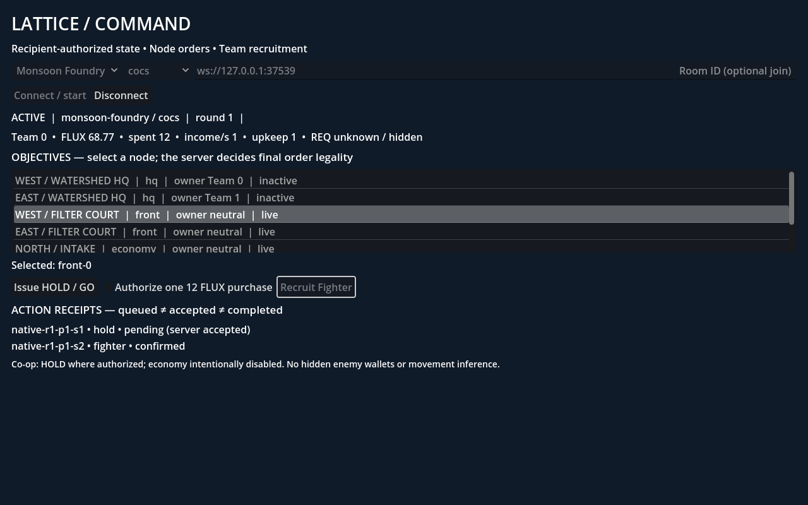

# COCS: DESTINATIONS — Godot Port

A native **Godot 4** port of [COCS](https://github.com/mojomast/cocs), a procedural
arena shooter featuring AI-inspired operators, competitive combat, vehicle
sports and LATTICE strategy modes.

Godot handles the native client, controls, world presentation, HUD and audio.
The original **Node.js simulation remains authoritative** over movement,
weapons, damage, objectives and match rules. The goal is a good Godot-native
game that preserves all nine DESTINATIONS maps and their gameplay identity.

**Status: actively developed, playable prototype.** Combat is available through
the native setup menu; sports, objectives and LATTICE have separate demo launchers.
This repository includes the original source and development history so the
simulation lock and verification evidence remain reproducible.

[Getting started](#getting-started) · [Current features](#current-features) ·
[Controls](#controls) · [Verification](#verification) ·
[Detailed release matrix](port/RELEASE_MATRIX.md)


## Current features

| Area | Available now |
|---|---|
| Arena combat | Meridian Exchange, Verdant Reliquary and Ember Crucible; Deathmatch, Team Deathmatch, Instagib and Rocket Arena |
| Native presentation | All nine map environments, operator and pickup models, skies, lighting and landmarks |
| Combat feedback | Reticle, confirmed-hit and damage indicators, source-driven projectiles and explosion flashes, procedural sound cues |
| HUD and controls | Health/armor bars, named weapon/ammo display, number-key and wheel weapon selection, team scores and results scoreboard |
| Puma sports demos | Ion Speedway racing and Aurora Stadium soccer: authoritative driving, next-checkpoint guidance, compact HUD, wall-aware chase, results and F5 restart |
| Objective demos | Tidal CTF pickup/drop/return/pass/capture; Sunscar Payload escort/contest/banked rollback/full delivery; compact HUD, results and restart |
| LATTICE command demo | Asterion Relay and Monsoon Foundry: synchronized objective list/map, own resources, HOLD orders, PvP Fighter and co-op REINFORCE purchases with explicit receipts |
| LATTICE world demo | Authoritative first-person traversal on Asterion/Monsoon, public objective markers and a same-connection tactical HOLD/recruitment panel |
| Session handling | Local server launcher, host setup, guest transport, stale-state handling, focus release, death/respawn and round-boundary control resets |

Sports now have independent one-lap target victory, local-driver soccer scoring
and results/restart acceptance. LATTICE offers both a command board and a
first-person world with tactical HOLD/recruitment controls; full strategy
rounds remain open. CTF pass/capture and full Payload delivery also have
independent normal-rate acceptance; broader combat/objective interactions remain open.
See the [release matrix](port/RELEASE_MATRIX.md) for evidence and remaining work.
Campaign work is deferred for substantial planning and research toward a remake.

<details>
<summary>More native screenshots</summary>

**Rocket Arena**


**Puma Soccer — compact HUD and near-wall camera**


**LATTICE command board**



These are native-client captures from real source-server sessions. They represent
the revisions described in their accompanying evidence directories.

</details>

## Getting started

### Requirements

- **Godot 4.5.2 stable**, standard build. The launcher checks the pinned version:
  `4.5.2.stable.official.6ce3de25a`.
- **Node.js 22.13+** and npm.
- **Python 3** for the verifier and sports launcher.
- Git, including repository history for source/provenance checks.

The documented workflow is tested on Linux with Godot's Compatibility renderer.
Graphical automation additionally uses Xvfb; normal play uses your desktop.

```sh
git clone https://github.com/mojomast/cocs-godot.git
cd cocs-godot
npm ci

# Use an absolute path to your Godot 4.5.2 executable.
export GODOT_BIN=/absolute/path/to/Godot_v4.5.2-stable_linux.x86_64
export GUEST_NODE_MODULES="$PWD/node_modules"

# Development helpers use this directory for isolated temporary projects.
mkdir -p /tmp/opencode
export TMPDIR=/tmp/opencode

# Export the locked map data and import the native project.
node tools/godot-export/semantic.mjs
"$GODOT_BIN" --headless --path godot --editor --import

# Start an owned local authority and open the native match setup.
PORT=0 node tools/godot-dev/launch.mjs --play --setup
```

`PORT=0` selects a free loopback port automatically. The launcher starts the
server and closes it when the client exits. You do not need a separate server
process for this workflow.

### Jump straight into combat

```sh
PORT=0 node tools/godot-dev/launch.mjs --play \
  --map=verdant-reliquary --mode=rockets
```

Supported combat map IDs: `meridian-exchange`, `verdant-reliquary`,
`ember-crucible`. Enabled modes: `deathmatch`, `teamdeathmatch`, `instagib`,
`rockets`. Add `--mute` to silence procedural cues or `--debug-hud` to show
diagnostic labels.

### Build an editor-free Linux prototype

The local packaging pipeline exports a Linux x86_64 executable/PCK and includes
the unchanged authoritative server modules and their runtime dependency:

```sh
python3 tools/godot-package/build.py --state /tmp/opencode/my-native-package
```

The builder prints the archive path and integrity hashes. Extract the archive,
enter `cocs-native-linux`, then run **`node run.mjs`** for native combat setup.
Playing requires Node **22.13+** and normal Linux desktop libraries; the editor,
Git, npm and original checkout are build-time tools only. The package supports
the same five experience routes. See the
[local package guide](port/native-linux-package/README.md) for prerequisites,
verification and launch commands. Generated archives stay outside the repository.
The latest independent rebuild includes sports coaching and world commands and
passes fresh-directory exported combat/world startup and failure cleanup; see
[package verification](port/reports/linux-sports-world-independent/README.md).

### Puma driving demos

With the environment above configured, run either:

```sh
PORT=0 node tools/godot-dev/launch.mjs --experience=sports --map=ion-speedway
PORT=0 node tools/godot-dev/launch.mjs --experience=sports --map=aurora-stadium
```

The common launcher uses an owned local server and runs until you close the
client or press Ctrl+C. The separate Python evidence launcher still uses a
private project copy and an **80-second** bound. See the
[driving handoff](port/native-puma-driving/HANDOFF.md) and
[camera/HUD notes](port/native-sports-polish/HANDOFF.md).
Ion shows the next source checkpoint and a mint directional frame. Both sports
display authoritative results and support **F5** restart, followed by **Enter**
and fresh movement keys. Optional `--time-limit=60..900` and `--round-target=N`
set ordinary match limits (1..10 laps or 1..15 goals). See
[progression verification](port/reports/sports-progression-independent/README.md).
Aurora also shows ball direction/distance and explicit **OWN / ATTACK** goals
derived from your authoritative team, plus passive shot-alignment coaching.
One-lap target victory and a genuine local soccer goal now pass independently;
see [sports victory verification](port/reports/sports-victory-independent/README.md).
Soccer always fills to four players with bots, so zero-bot `--practice` is not
supported by the locked source.

### LATTICE command board

```sh
PORT=0 node tools/godot-dev/launch.mjs \
  --experience=lattice --map=asterion-relay --mode=cocs
```

Click **Connect / start**, select an objective, and issue a HOLD order. In PvP,
authorize one **12 FLUX** purchase and click **PvP Fighter**. The UI separates
locally queued commands, server acceptance, confirmation and rejection.
Use the **List / Map** selector to see a clickable public-objective diagram;
selecting a marker does not issue an order. The diagram fits both axes to the
panel and represents neither terrain distances nor topology links.

Use `--map=monsoon-foundry` for the second map or `--mode=cocs-coop` for co-op.
Co-op **REINFORCE** costs **50 team FLUX and no REQ**, during a naturally opened
between-wave window (about two minutes in the verified runs). Wait for permission,
authorize a fresh purchase and activate REINFORCE. The UI explains unavailable
windows or budgets. See [co-op verification](port/reports/lattice-economy-independent/README.md).
The common launcher has no harness deadline; the separate original evidence
launcher retains its **120-second** bound. The compact
layout fits the basic command and purchase receipts at 960×640; longer history
remains scrollable. See the
[LATTICE guide](port/native-lattice/README.md) for details and limitations.

### LATTICE world traversal

```sh
PORT=0 node tools/godot-dev/launch.mjs --experience=lattice-world --map=asterion-relay --mode=cocs
PORT=0 node tools/godot-dev/launch.mjs --experience=lattice-world --map=monsoon-foundry --mode=cocs-coop
```

Click to engage, move/look with **WASD/mouse**, and **Escape** to release. Press
**C** for tactical commands: select a public objective, explicitly issue HOLD,
or authorize one recruitment purchase. The panel pauses movement and uses your
existing player connection. Close with **C / Escape**, release controls, then
click the world to resume. PvP Fighter costs 12 FLUX; co-op REINFORCE requires
50 FLUX and a source-authorized between-wave window. See
[world commands verification](port/reports/lattice-world-commands-independent/README.md)
and [world traversal verification](port/reports/lattice-world-independent/README.md).

### CTF and Payload demos

```sh
PORT=0 node tools/godot-dev/launch.mjs --experience=objectives --map=tidal-citadel
PORT=0 node tools/godot-dev/launch.mjs --experience=objectives --map=sunscar-convoy
```

These standalone, zero-bot demos use ordinary infantry controls. In CTF, approach
the opposing flag to pick it up; **E** passes or drops it. In Payload, move close
to the cart to escort it. The common launcher has no harness deadline. The
separate evidence launcher has a **180-second outer deadline**, which is
separate from authoritative results.
The panel-backed objective HUD composes with the combat HUD and results
scoreboard. Press **Enter** at results to restart, then deliberately recapture.
See the
[objective guide](port/native-objective-gameplay/HANDOFF.md) and
[independent progression verification](port/reports/objective-progression-independent/README.md).
Full Payload delivery after checkpoint-banked rollback and CTF teammate
pass/capture also pass independently, including results and neutral restart:
[completion verification](port/reports/objective-completion-independent/README.md).

### Open the editor or map viewer

```sh
"$GODOT_BIN" --editor --path godot
"$GODOT_BIN" --path godot
```

The default scene is the map viewer. Use the launchers above for server-backed
combat, sports, objective or LATTICE play.

## Controls

### Infantry

| Input | Action |
|---|---|
| Click / mouse | Capture pointer, fire / look |
| WASD | Move |
| Space | Jump |
| Shift / Ctrl | Sprint / crouch |
| R | Reload |
| E / F | Interact / mobility ability |
| 1–9, 0 / mouse wheel | Request an available weapon |
| Tab | Hold scoreboard open |
| Escape | Release pointer and active controls |

Focus return, respawn and round changes require deliberate recapture; held
controls are not automatically replayed.

### Puma

Wait for the countdown, then press **Enter** to engage. Use **W/S** for
forward/reverse, **A/D** to steer, **Space** to brake, **Shift** to boost and
**Escape** to release. **R** requests a race reset on Ion Speedway.
After results, **F5** starts a new round; press Enter and fresh movement keys.

## All nine DESTINATIONS maps

| Map | Native focus |
|---|---|
| Meridian Exchange | Urban infantry arena |
| Verdant Reliquary | Ruins and infantry combat |
| Ember Crucible | Industrial combat arena |
| Tidal Citadel | Team objectives and Capture the Flag |
| Sunscar Convoy | Payload and combined-arms objectives |
| Asterion Relay | LATTICE commands and native world traversal |
| Monsoon Foundry | LATTICE commands and native world traversal |
| Ion Speedway | Puma racing |
| Aurora Stadium | Puma soccer |

The complete required mode set is recorded in the
[locked map-selection contract](port/contracts/map-selection.json).

## Verification

For a fresh clone, follow the [native CI bootstrap](port/native-ci/README.md)
first. Verification needs full Git history and both generated GLB probes in
addition to semantic map export. The bootstrap pins and checks the official
Godot editor and documents the required Chromium build dependency.

```sh
PORT=0 python3 tools/godot-dev/verify.py
```

The combined verifier checks the pinned toolchain/source, semantic export,
Godot import, protocol handling, input gates, presentation, cleanup, native
sessions and two-client behavior. It fails on engine errors even when a process
returns zero. Results are written to `port/reports/verification.json`.
The latest integrated local run passes **65 gates**, including soccer coaching,
in-world LATTICE commands, package routing, sports and objective
progression, LATTICE map selection, launcher routing, GLB material sides and
projectile navigation. Native
[GitHub Actions](https://github.com/mojomast/cocs-godot/actions/workflows/godot-native.yml)
previously passed the 63-gate packaging snapshot from a fresh Ubuntu checkout;
hosted evidence is tracked separately from newer local runs.

Focused real-session and graphical evidence is documented in:

- [Rocket Arena and menu verification](port/reports/projectile-independent/README.md)
- [Sports driving, HUD and camera verification](port/reports/sports-polish-independent/README.md)
- [Sports lap, results and restart verification](port/reports/sports-progression-independent/README.md)
- [Sports target victory and local soccer goal](port/reports/sports-victory-independent/README.md)
- [LATTICE in-world command panel](port/reports/lattice-world-commands-independent/README.md)
- [Visible damage and health pickup verification](port/reports/native-health-hud-independent/README.md)
- [LATTICE implementation and evidence](port/native-lattice/HANDOFF.md)
- [LATTICE native mouse/key acceptance](port/reports/lattice-physical-independent/README.md)
- [LATTICE tactical-map verification](port/reports/lattice-map-independent/README.md)
- [LATTICE co-op recruitment verification](port/reports/lattice-economy-independent/README.md)
- [LATTICE world traversal](port/reports/lattice-world-independent/README.md)
- [CTF and Payload independent verification](port/reports/objective-independent/README.md)
- [CTF capture, Payload contest/checkpoint and restart](port/reports/objective-progression-independent/README.md)
- [Full Payload delivery and CTF teammate pass](port/reports/objective-completion-independent/README.md)
- [Exported sky material-side correction](port/reports/glb-side-independent/README.md)

Passing automated checks is distinct from complete mode, human usability or
hardware acceptance. Failed attempts are retained alongside their resolutions.

## Repository layout

```text
godot/                 Native Godot project, gameplay presentation and tests
game/                  Original authoritative simulation and map definitions
server/                Original Node.js multiplayer server
tools/godot-export/    Locked semantic export and source verification
tools/godot-dev/       Native launcher and combined verification
port/                  Port documentation, contracts, demos and evidence
```

## Development and provenance

Start with the [port overview](port/README.md),
[release matrix](port/RELEASE_MATRIX.md) and
[source lock](port/contracts/source-lock.json). The current simulation baseline
is `mojomast/cocs` at `51289b79c627a26a381ba556b92bab71f93f3732`.

Native improvements and simpler implementations are welcome when they preserve
map identity and gameplay intent. Keep presentation separate from authority,
retain asset notices, and document what was actually tested.

The original browser-game README is preserved as [README.web.md](README.web.md).
Existing attribution and asset-rights findings are documented in the
[asset audit](port/asset-audit/HANDOFF.md); this port does not introduce a new
blanket license for inherited code or assets.
