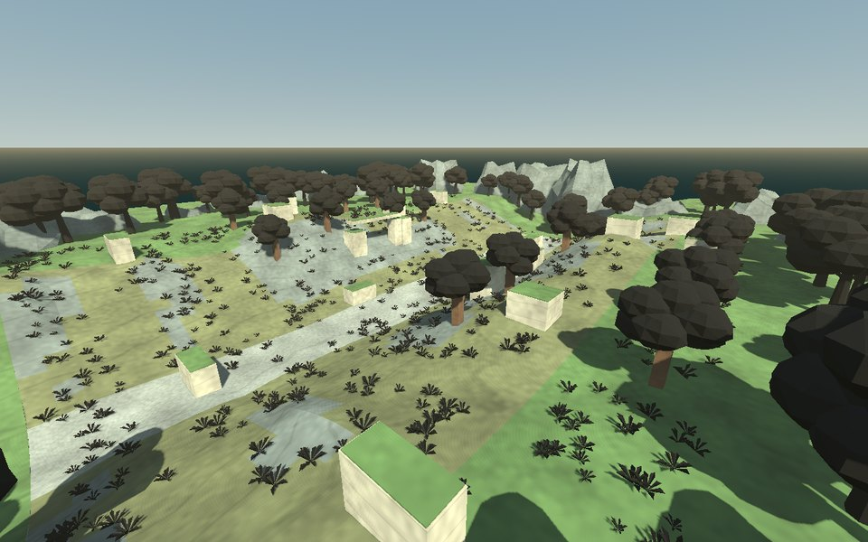
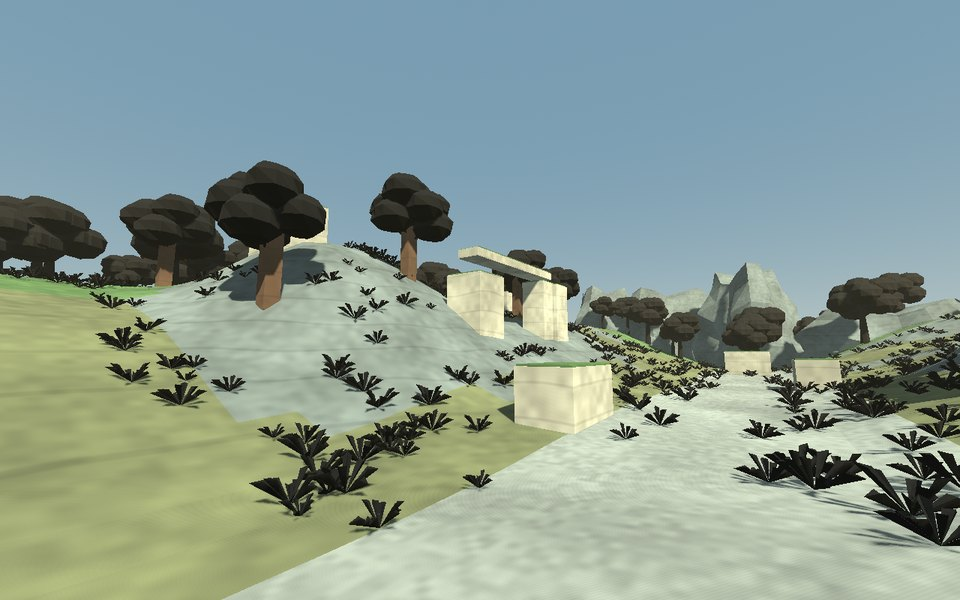
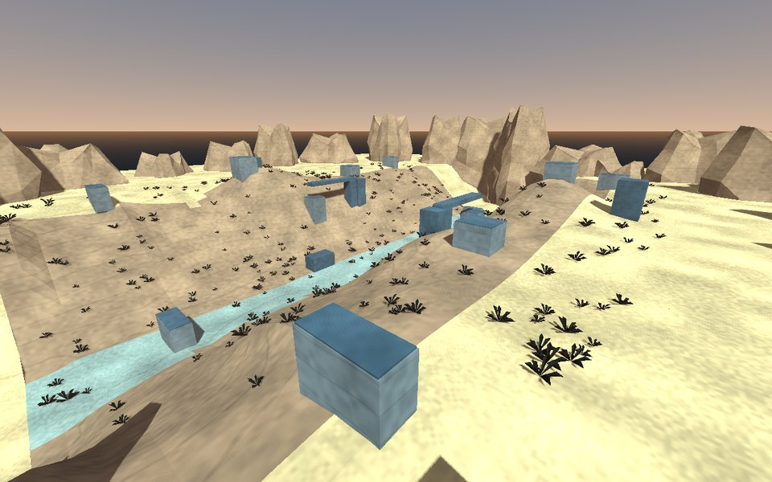
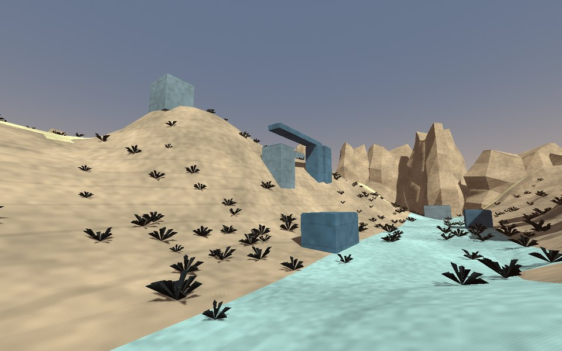
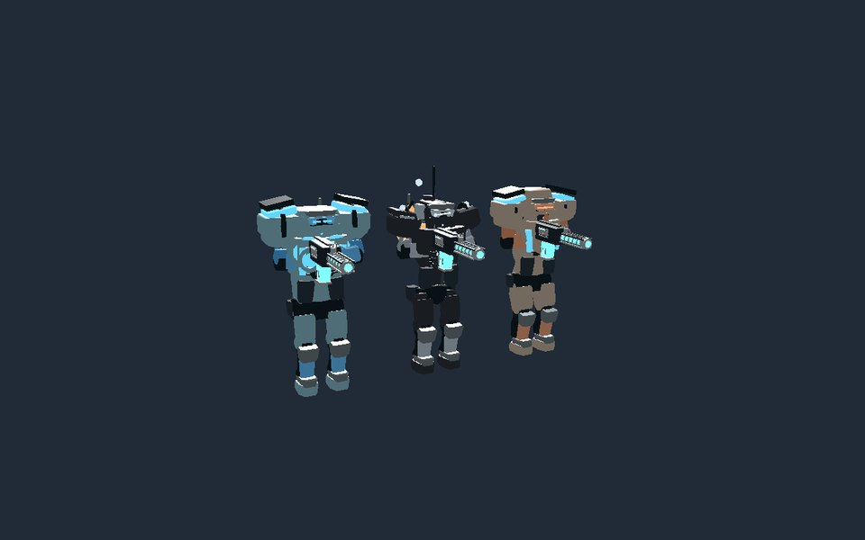
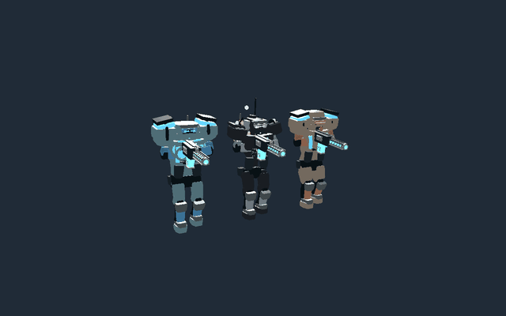
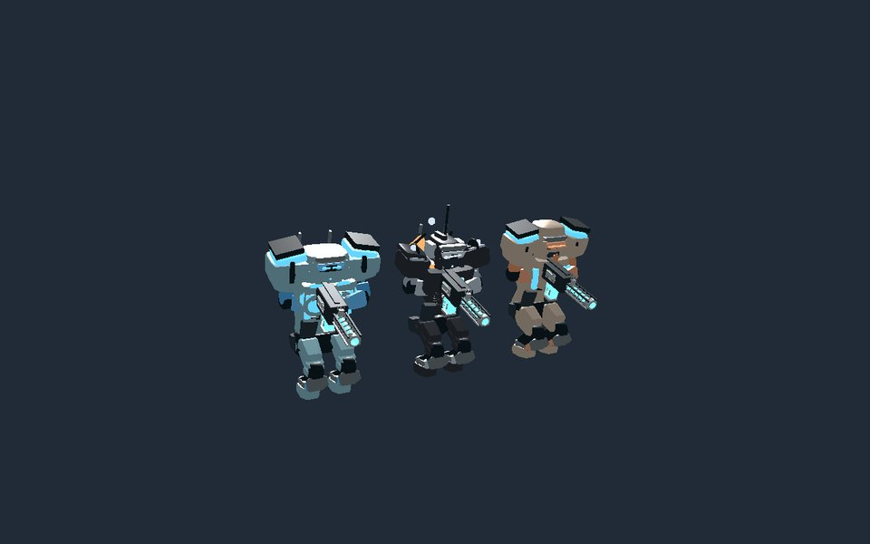
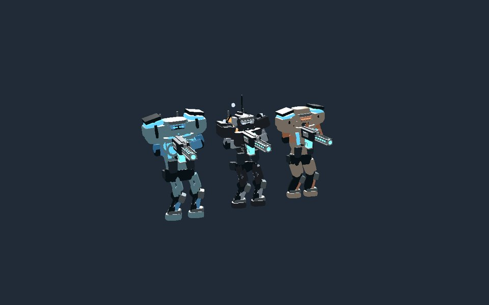

# Terrain biomes and character upgrade

Two new playable Deathmatch arenas join the native menu and development/package
launchers. All nine source operators gain joint-mounted armor, helmet details,
identity-colored optics and movement animation.

| Map | Terrain and traversal |
|---|---|
| Canopy Divide | 11.4 m of elevation across a winding forest ravine, moss/soil/gravel/rock surfaces, raised ridge circuits, branching trees, fern clusters and open stone ruins. |
| Basalt Reach | 16.2 m of elevation across a canyon channel, sand/gravel/rock surfaces, basalt outcrops, sparse scrub and metal relay gantries. |

Each arena spans 96 × 80 m, with two upper routes, a lower route and four
separated ascents. Opposing spawn pools and cover have equal terrain grades;
health, armor and ammunition have mirrored placements. The central rocket and
upper rail pickups reward exposed crossings. This is an initial balance layout;
human competitive playtesting is still needed.






The authoritative Node simulation and native Godot collision consume the same
3,840 terrain triangles per map. Ramps use one continuous support sheet, matching
the simulation's terrain model. Solid tree trunks and cover are shared collision
geometry; crowns, foliage, trims and distant cliffs are scenery. Vegetation uses
deterministic placement outside route clearances, at most two MultiMesh batches,
and a wind shader.

## Characters and animation

Beveled breastplates, shoulder plates, bracers, thigh/shin guards, toe caps,
visor lenses, backpack vents and sensors attach to the existing articulated
rig. Character colors and sensor silhouettes vary across the nine operators.
Armor details disappear at the far visual LOD.

Locomotion uses distance-driven steps, lateral and reverse travel, acceleration
lean, chest counter-rotation, a damped landing response and deeper crouching
with foot contact. Weapon grips are solved after the movement layer. Mounted
actors do not walk with vehicle velocity. Pose resets and reduced-motion mode
are preserved; authoritative movement and hit geometry stay unchanged.






## Launch and regenerate

Use the repository's pinned Godot 4.5.2 and normal development setup, then launch:

```sh
PORT=0 node tools/godot-dev/launch.mjs --experience=native-dm --map=canopy-divide
PORT=0 node tools/godot-dev/launch.mjs --experience=native-dm --map=basalt-reach
```

Both maps are also selectable through Native Deathmatch in the setup menu.
They are included in the package asset closure and Windows Deathmatch wrapper;
existing published release archives do not contain this change.

```sh
node tools/godot-biomes/compile.mjs
node tools/godot-package/gen_routes.mjs
node --test tools/godot-biomes/biomes.test.mjs
"$GODOT_BIN" --headless --path godot --script res://tests/biomes/contracts.gd
```

For desktop screenshots and a sequence of motion frames:

```sh
"$GODOT_BIN" --path godot --script res://tests/biomes/render.gd -- \
  --capture-dir=/tmp/biome-upgrade
```

## Validation

- Six new Node tests passed: deterministic committed geometry, source-walkable
  routes and spawn/pickup navigation, and 60-second bot combat with results and
  fresh restarts on both maps. Seeded matches recorded 10 and 11 kills.
- Twenty routing/package tests and 43 existing native authority/launcher tests
  passed, including the expanded eight-map roster. Launcher fixture bot limits
  were aligned with the existing production limit of 24.
- Godot biome/model contracts passed 578 native ray queries against source
  route heights, plus armor, directional gait, weapon grip, landing, crouch foot
  contact, far LOD, reset and mounted-velocity checks.
- All nine original operator pose fixtures passed 6,138 joint matrix comparisons
  (maximum error 2.4e-7); operator presentation and 706 main-menu checks passed.
- Live native Deathmatch smoke checks passed movement, firing and authoritative
  acknowledgments on both maps.
- These previews are captures from Godot 4.5.2's Compatibility renderer using
  software llvmpipe. The GIF combines consecutive captured animation frames.
  Shader compilation succeeded. Hardware frame rates and release exports were
  not measured or built; this evidence does not establish competitive balance.
