# Abyssal V corrective successor — native review gallery

**Grant:** MOTH-BLENDER-20261003-V. **Candidate:** `revision2-corrective-v/`,
`b010a0764e3754b9d1e6ff3839e7c319d871336cf5b242a36cd512dd9ee3aa86`.
This is an isolated candidate, not production promotion. The frozen T revision-2
and original `ee979520…` corrective source/artifact attempts remain distinct.

| View (same eye/target/FOV in each pair) | Accepted runtime before | New corrective candidate |
|---|---|---|
| SW retaining wall at player height | 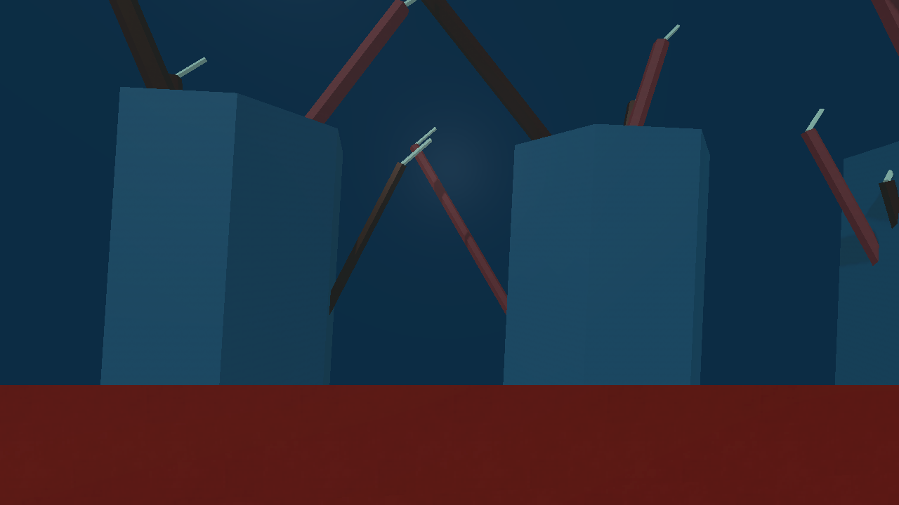 | 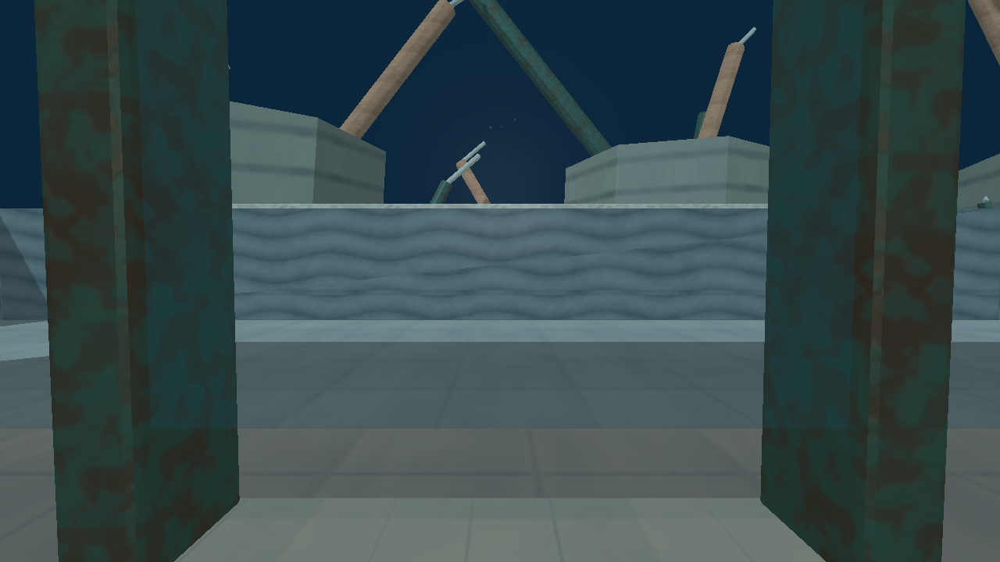 |
| SW terrace traversal | 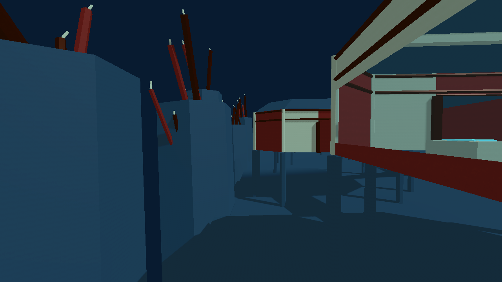 | 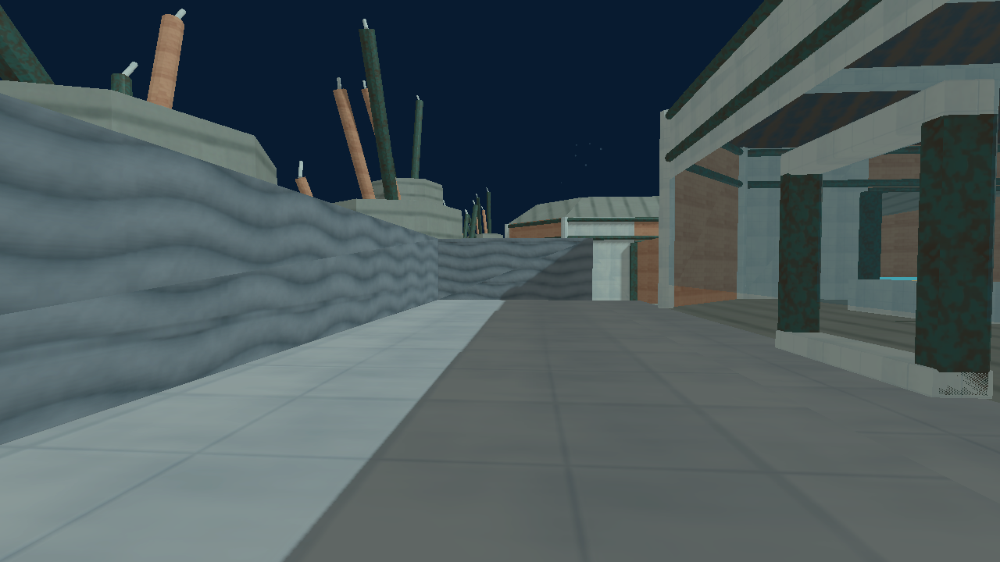 |
| SW opened observation bay | 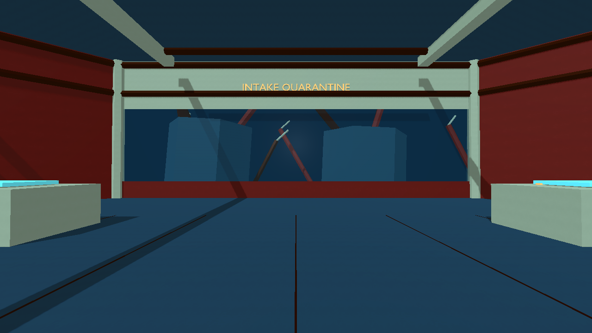 | 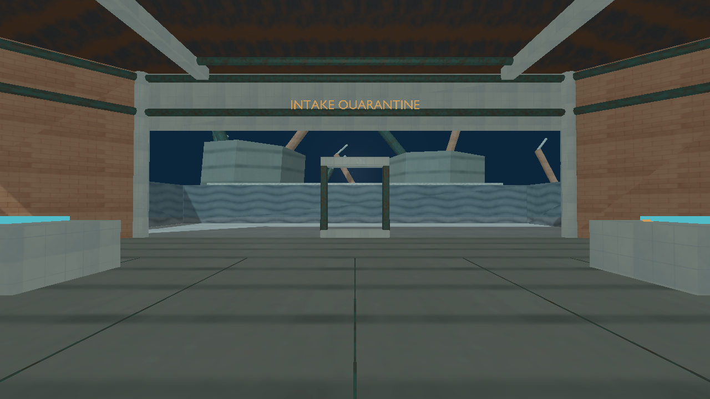 |
| SW exterior ledge and fins | 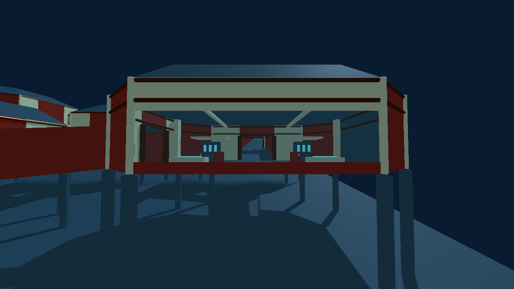 | 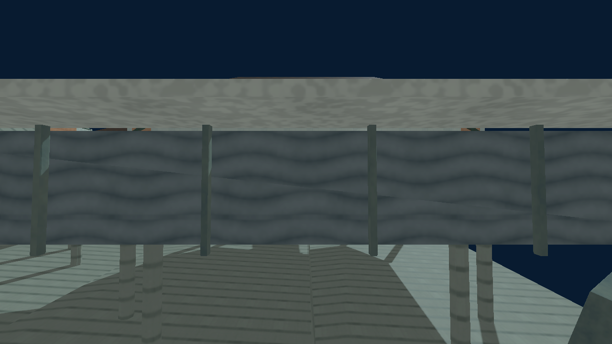 |
| SE retaining wall at player height | 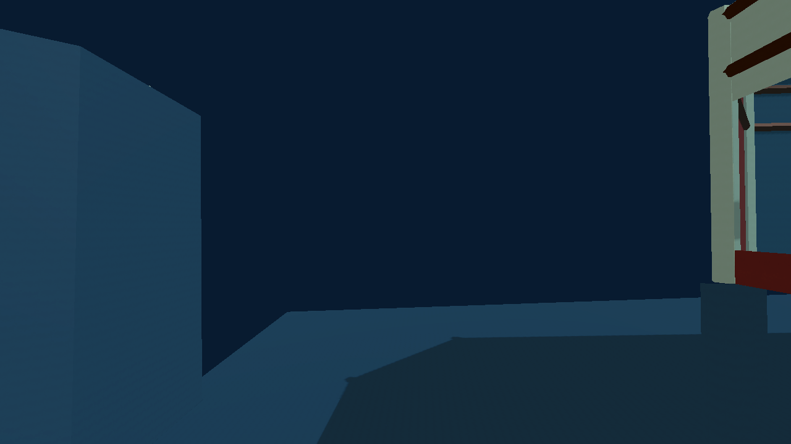 | 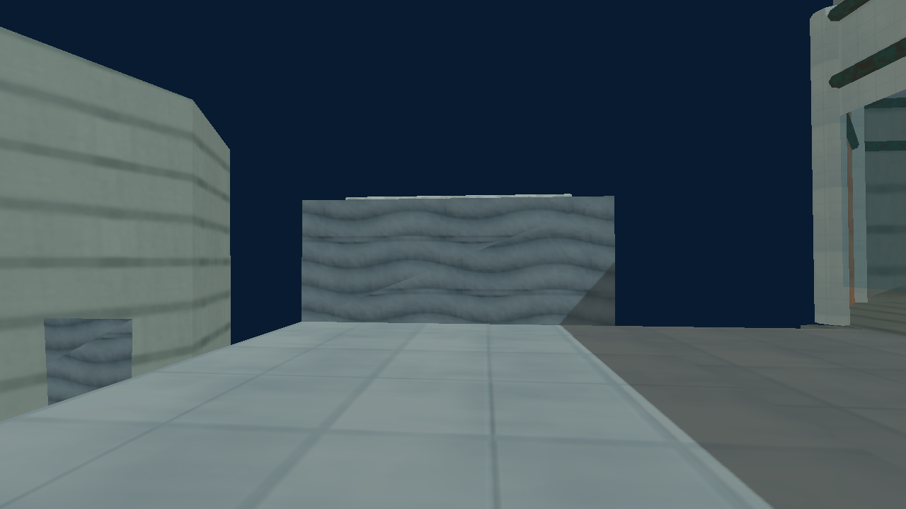 |
| SE terrace traversal | 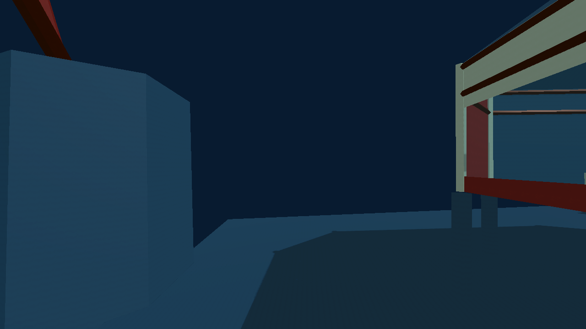 | 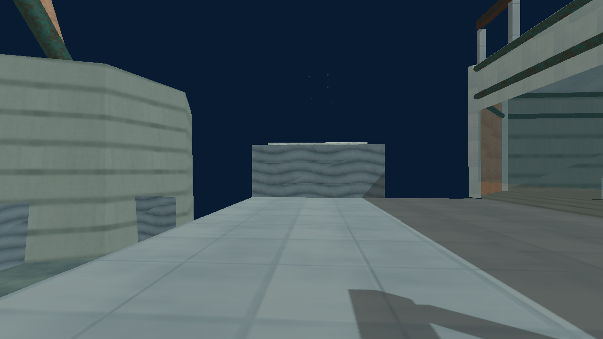 |
| SE exterior ledge and fins | 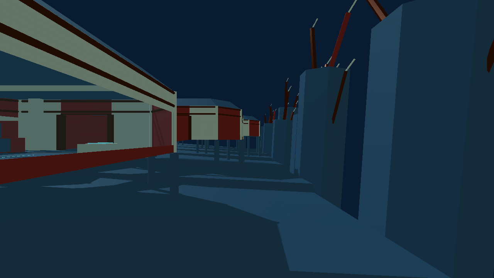 | 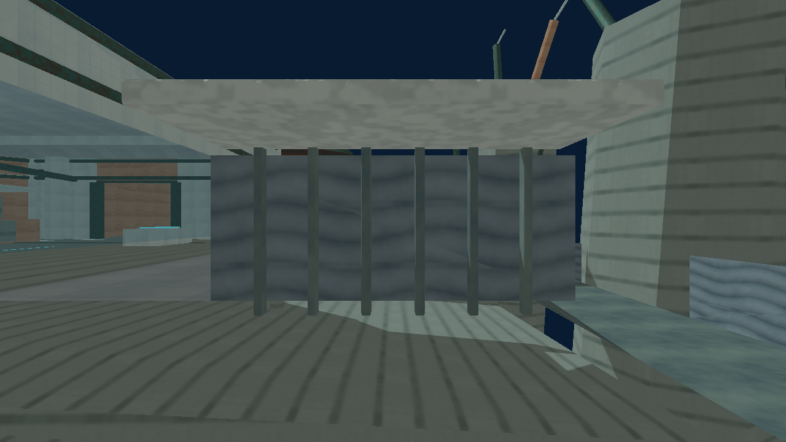 |
| Overhead and route signage | 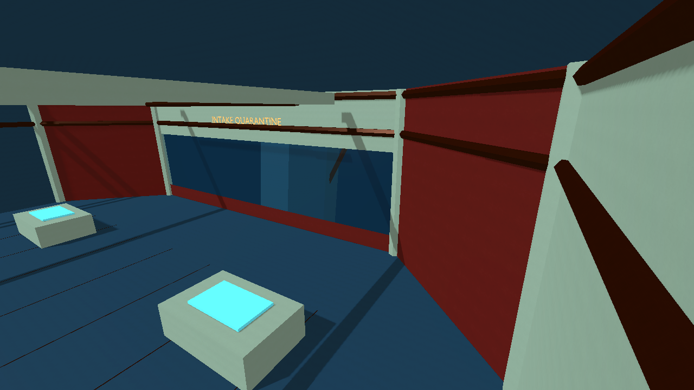 | 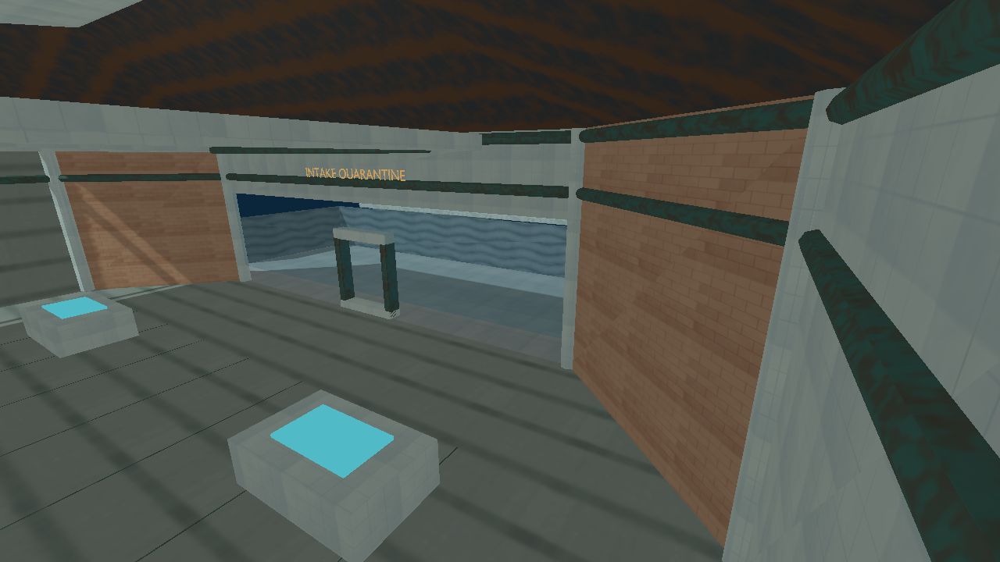 |

These are original **1280×720** PNGs, no postprocessing. The before side is the
accepted runtime WorldMap/art under the same isolated stage; it has no eligible
Abyssal dressing profile. The after side is the exact imported corrective GLB
with a candidate-only copy-local production Binder schema/profile that preserves
all imported PBR materials. Both use `abyssal_presentation.gd`. The parent
snapshot has no `WeatherService`, so these are **neutral staged presentation**,
not full-game production-weather or hosted-mode screenshots. Exterior angles
show nontraversal forms and are not claimed as player standing positions.

## Native identity and measured checks

- `corrective.blend` SHA-256 `16e244942c84c810802fa56ec37efca5b39b95f2872d373175d68cc94e48d93f`;
  `corrective.glb` SHA-256 `770c8622f6e9dc401fb6dc5cce4225efc5b930c1a88f29f9f0c324170db07f87`.
  Fresh reopened-master reexport is **byte-identical**, including all geometry,
  transforms, normals, tangents and embedded PBR images. 47 actual primitives,
  229,620 actual triangles, 30 packed image datablocks, 12 labels. The 150k
  triangle target is advisory and the report marks it exceeded.
- `geometry-audit.json`: strict scene-backed GLB bounds/index/count checks;
  actual colour/normal/roughness pixel proofs in `material-report.json`;
  all three historical P1 ray spans match new art to collision (clear, floor 6,
  floor 0); world-contact checks find all **14** actual cave solids.
- `solid-normal-report.json`: all fourteen actual GLB solid contact-face
  windings agree with authored outward faces (minimum dot product **1.0**).
- `world-check.json`: imported GLB has **47** art meshes and no gameplay
  colliders; actual `WorldMap` holds authority JSON collision; **78** sampled
  retaining-wall band rays and **four** beyond-end clear rays passed. It records
  **518** capsule placements (12 spawns, objective anchors, terrace centers,
  and all 501 authored nav points). Nine ramp-adjacent route samples required
  **0.15 m** vertical accommodation; no non-ramp overlap remained. Radius .52 m
  includes the nominal .42 m body, .05 m bevel and clearance margin.
- `captures/capture-report.json` records the exact view coordinates, renderer,
  drawing/memory counters and eight-frame static cadence separately from
  gameplay FPS. Backend: Mesa llvmpipe/OpenGL compatibility; no dedicated-GPU
  frame-rate claim. `evidence-hashes.json` pins every packaged byte.

The original `ee979520…` V attempt discovered that its last southwest nav
point sat exactly on the retained east wall. `old-ee97-attempt-receipts/`
preserves all five original V attempt logs, process-group receipts, hashes and
failure reports. The V2 successor moves just that route endpoint inward and
retains original floors, walls, blocks, spawns, objectives and all cave forms.

**Remaining review gates:** exterior falls and special traversal, swept chase
camera and hosted gameplay journeys/mode completions, weather/production finish,
and parent approval/promotion. Native contact and occupancy success here is
specific to the measured probes, not a claim of every possible traversal.
