# Stormglass Causeway · T-grant original PNG pairs

Accepted JSON and art on the left; separately staged candidate JSON and exact
T GLB on the right. The cameras match exactly. See `capture-manifest.json`
for original PNG SHA-256s and static renderer measurements.

| View | Accepted before | Candidate after |
|:--|:--|:--|
| Overview | 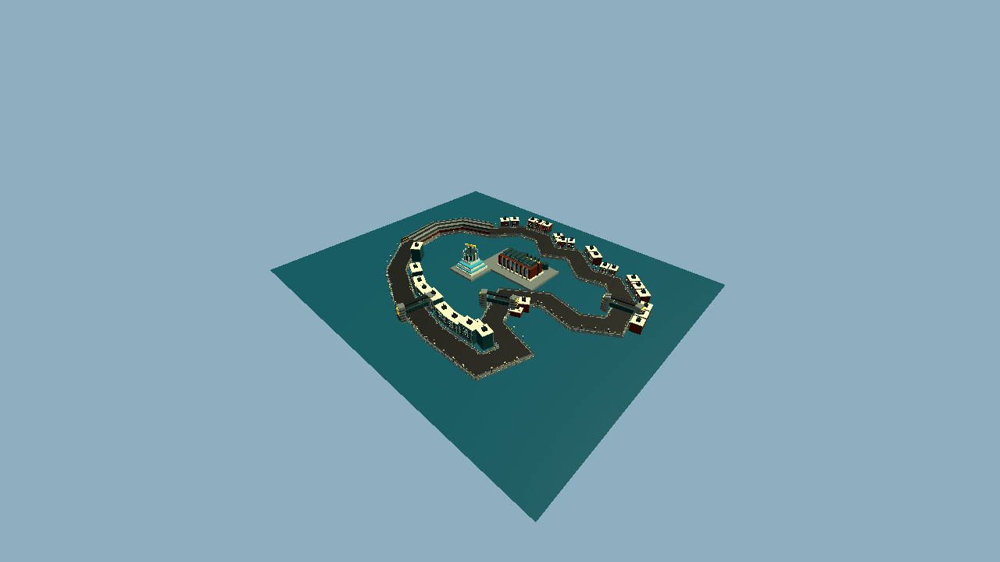 | 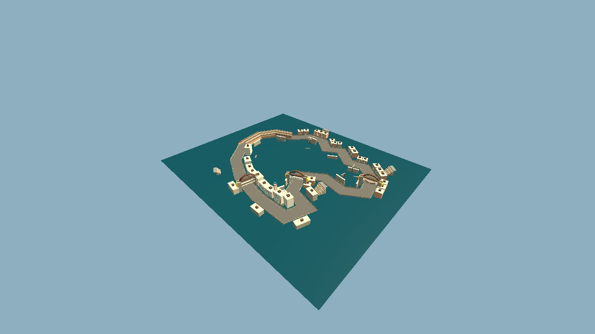 |
| Terminal | 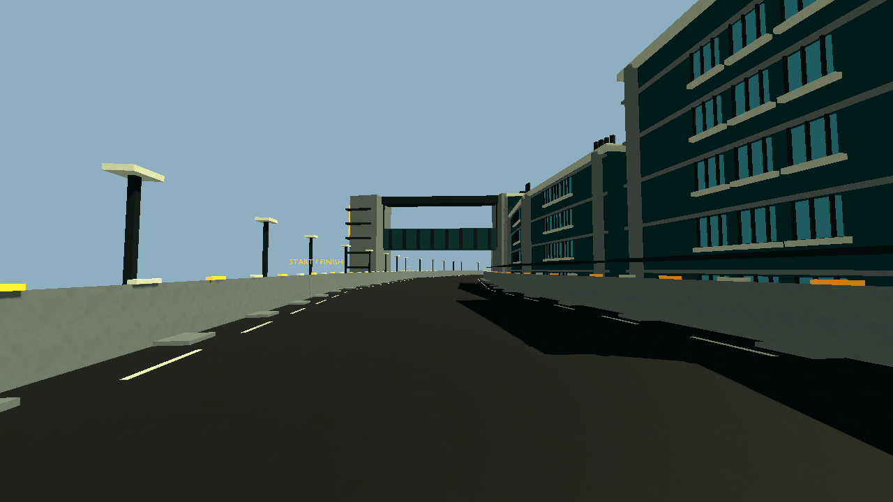 | 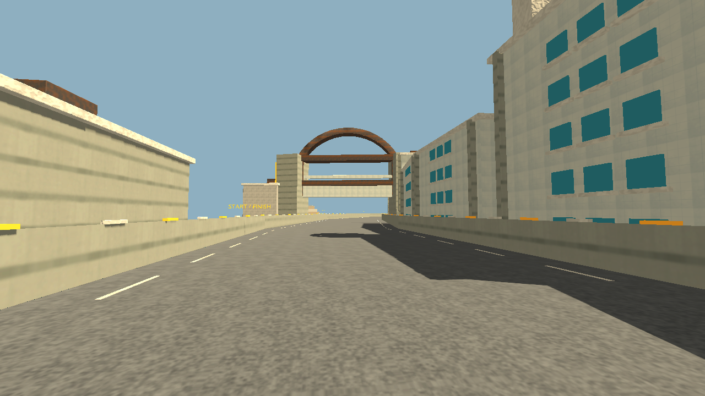 |
| Freight bore | 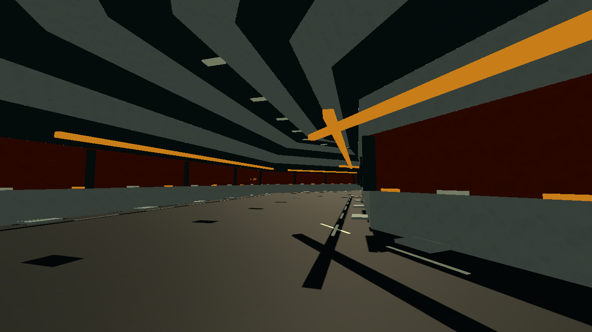 | 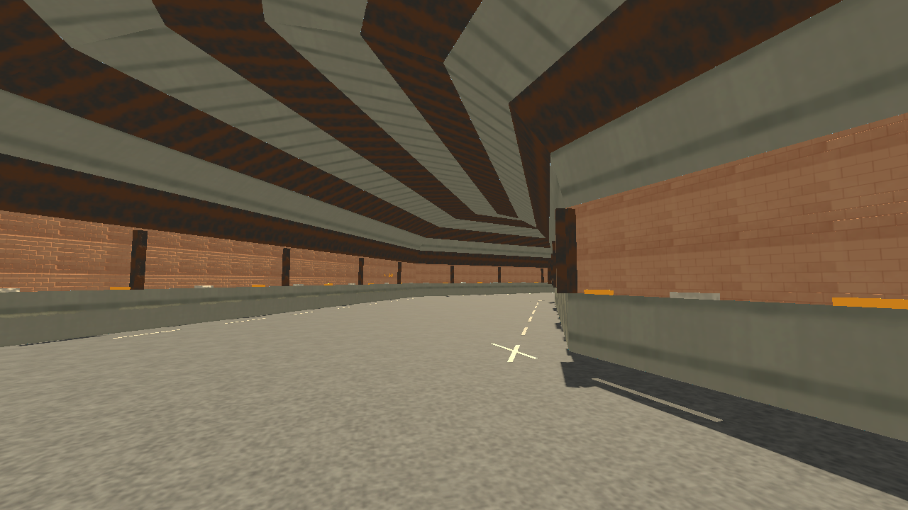 |
| Quay chicane | 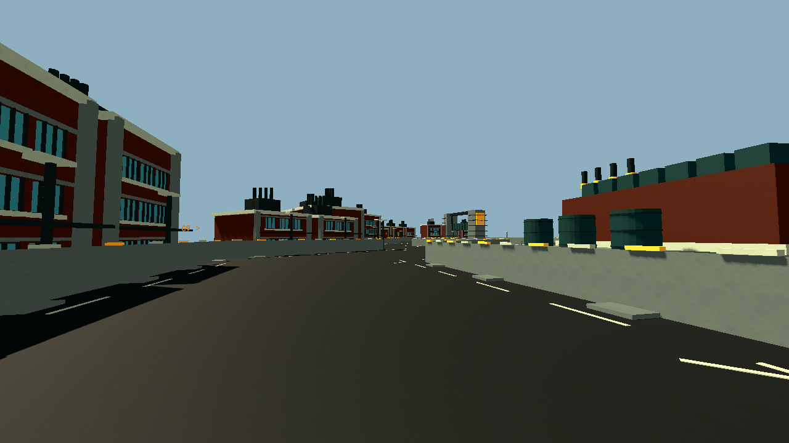 | 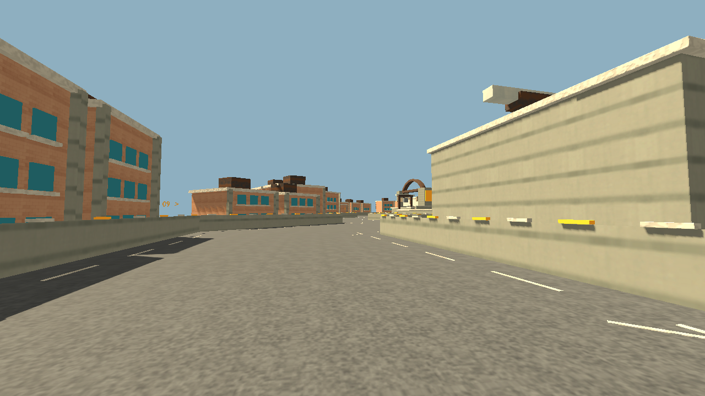 |
| Surgeworks | 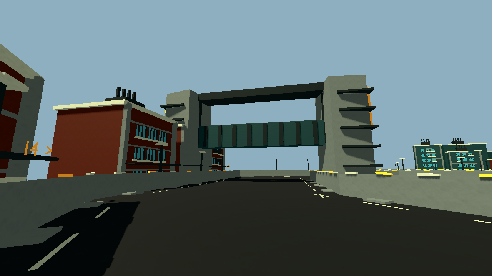 | 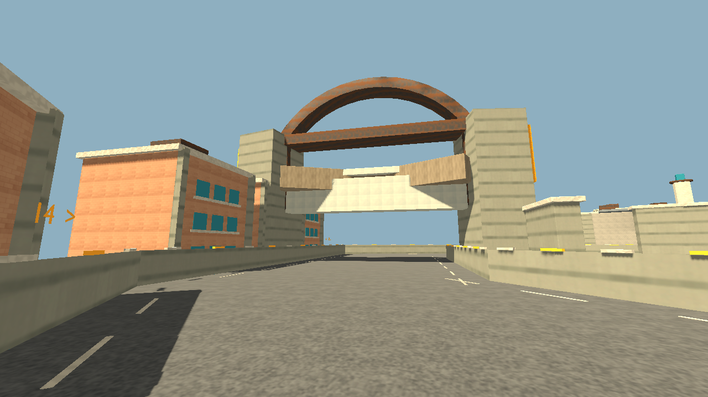 |
| Return gate | 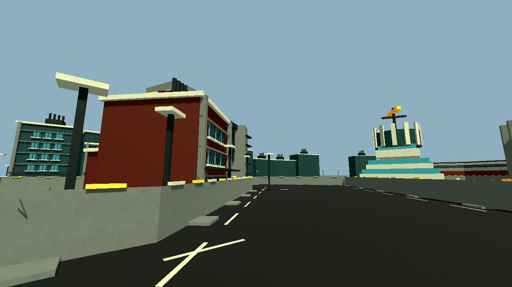 | 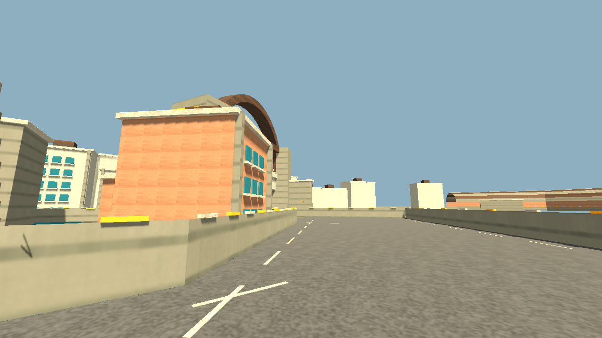 |
| Seawall relief | 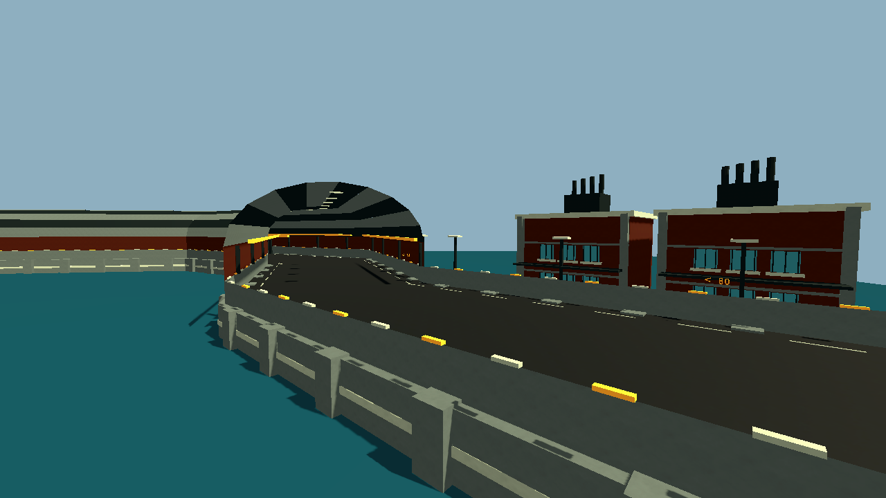 | 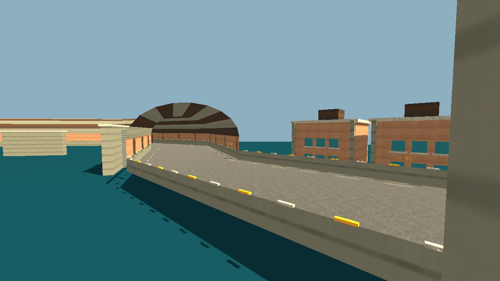 |
| Checkpoint arch | 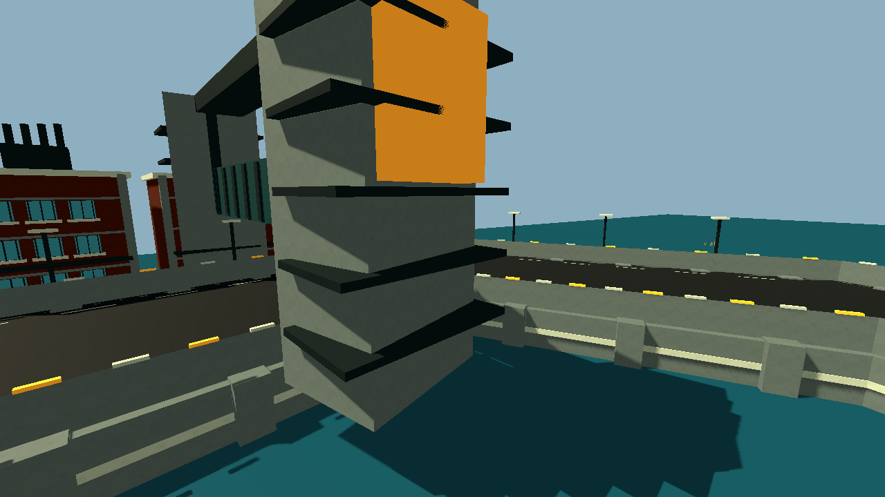 | 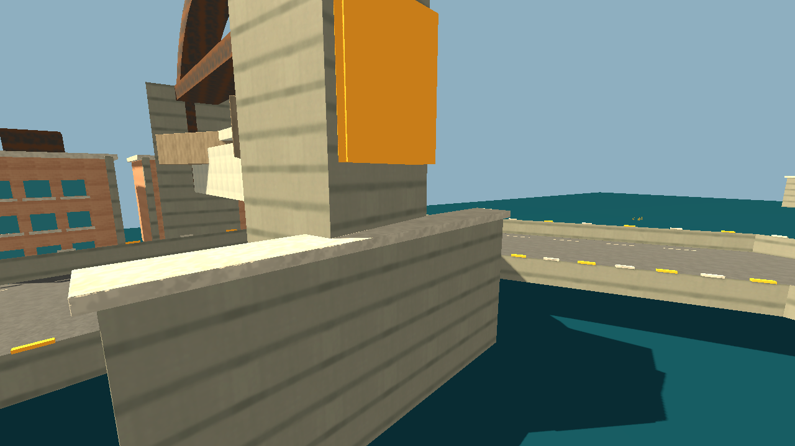 |
