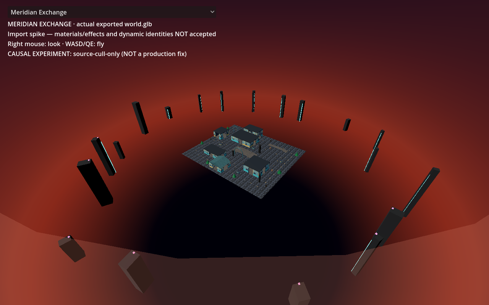

# Meridian blank GLB render — causal review

**Confirmed exporter semantic loss; production visual defect remains open.**
The original `port/reports/meridian-glb.png` is a view of the **outside of an
opaque sky sphere**, not a missing map. Restoring only the source sky's
`BackSide` culling in a private experiment exposes the original map at the
documented camera. The exporter is reserved by another lane, so this handoff
contains the exact correction target and executable evidence rather than a
camera workaround or a node-index patch in the shared viewer.

## Executed images (all read with the image tool)

| Capture | Observed result |
| --- | --- |
| [Initial direct reproduction](before.png) | Maroon sky field behind the UI; no visible map. Byte-identical to the historical screenshot. |
| [Harness baseline](causal-run-2/baseline.png) | Same failure, byte-identical to both images above. |
| [Source culling restored, same camera](causal-run-2/source-cull-only.png) | Textured ground, six building masses, plaza structures, trees and surrounding skyline pillars visible. Sky/haze remains visibly wrong; foreground haze has a hard edge. |
| [Camera moved inside, original material](causal-run-2/camera-inside.png) | Larger map visible, but sky disappears into the dark clear background. This is a diagnostic counterexample, not a proposed fix. |
| [Semantic viewer, original camera](causal-run-2/semantic.png) | Semantic support surface, solids and markers visible in the same central framing. |



The experiment visibly labels itself `NOT a production fix`. Only the sky
surface material's culling changes; geometry, vertex colors, normals, textures,
lights, scene transforms and camera stay as imported. The existing UI gains the
experiment label. No original mesh is removed, hidden, resized or recolored.

## Exact cause and native inspection

- Camera: `(110, 125, 140)`, looking at `(0, 0, 0)`, distance **217.543106 m**,
  FOV 75°, near 0.05, far 2000. Camera initialization is
  `godot/world/viewer.gd:14–16`.
- Original GLB: **2,060,200 bytes**, SHA256
  `a41094bdbafd7a6796d86d175982aab958e3500e8d8514f820dfa36c362d73ea`.
  This matches both `port/reports/meridian-exchange-glb.json` and
  `port/reports/glb-reproducibility.json`.
- **glTF node 56 → mesh 48 → primitive 0 → material 22** is the sky sphere.
  It has no node transform (identity); its parent root is identity too.
  Local/world bounds are `(-185,-185,-185)` through `(185,185,185)`.
  Native imported path relative to `viewer.world`: **`Node/Mesh56`**.
- POSITION/NORMAL/TEXCOORD_0/COLOR_0 accessors are 198/199/200/201; index accessor
  is 202. Binary inspection finds **2,976 outward-wound triangles**, zero inward
  or degenerate triangles, and all 1,617 vertex normals point outward.
- Material 22 retains `KHR_materials_unlit` and vertex color but has no
  `doubleSided` or source-side metadata. Godot imports it as
  `CULL_BACK=0`, `DEPTH_DRAW_OPAQUE_ONLY=0`, `SHADING_MODE_UNSHADED=0`,
  `TRANSPARENCY_DISABLED=0`, white albedo, vertex colors enabled.
  Thus an opaque front-facing sphere surface is between the outside camera
  and the actual map.
- The private correction duplicates this **one material**, sets
  `CULL_FRONT=1`, and assigns it to that one surface. It restores the source
  `BackSide` rasterization. The map becomes visible at the **unchanged camera**.
- The alternative experiment changes only the camera to `(55,62.5,70)` (inside
  the sphere). Its missing sky demonstrates why shortening the camera distance
  does not restore source semantics.

There are **127 native mesh nodes**, with every imported local/world AABB,
transform, visibility and surface material recorded in the three case JSON
files. [analysis.json](analysis.json) verifies the initial inventories are
identical, the one-property correction is exact, and the historical and new
baseline PNG bytes match. These controls support the visual diagnosis; they
are not image-fidelity acceptance tests.

## Source/exporter trace and proposed minimal correction

Read-only source inspection:

1. `game/environment.mjs:72–83`: `addSky` creates radius-185
   `SphereGeometry(185,48,32)`, vertex-gradient colors and
   `MeshBasicMaterial({vertexColors:true, side:T.BackSide, fog:false,
   depthWrite:false})`. It sets `renderOrder=-1`, `userData.environment=true`,
   `userData.sky=true` and disables frustum culling.
2. `game/view.mjs:2317` adds that sky to the exported world.
   `game/view.mjs:3871` moves the sky to the source camera every update.
3. `tools/godot-export/harness.html:34–50` strips object `userData`, clones
   the world, expands instances and directly calls the pinned `GLTFExporter`.
   There is no conversion of `BackSide` triangle winding or runtime sky behavior.
4. Installed Three.js is **0.185.1**. Its
   `examples/jsm/exporters/GLTFExporter.js:1810–1811` emits `doubleSided` only for
   `DoubleSide`; it does not represent `BackSide`. SHA256 of that dependency:
   `318c588c527d03528a60610a4fc420018375a5c1bcf520e48f3666c5bc28d90d`.
5. Source sky child **glTF node 59 → mesh 51 → material 25** is the additive
   horizon haze band (`game/environment.mjs:101–102`), also `BackSide` and
   `depthWrite:false`. It remains uncorrected in the one-variable experiment.
   Its transform is identity relative to the sphere; bounds are approximately
   `(-182.1351,-45.3175,-182.1351)` through `(182.1351,87.7876,182.1351)`.
   Nodes 57/58 are the sun disc/glow with their authored transforms retained.

**Minimal export fix to delegate to the exporter owner:** normalize `BackSide`
triangle meshes on the export-only clone before `parseAsync`: clone shared
geometry, reverse each triangle's winding, invert its normals consistently,
and clone the material as `FrontSide`. Preserve positions, UVs, vertex colors,
groups and source materials. Handle indexed and non-indexed triangles; reject
or explicitly split mixed-side material groups rather than silently changing
unrelated surfaces. Apply to both the sky and haze when their source material
requests `BackSide`. Do not set everything double-sided: that would keep the
near exterior sphere visible and retain the occlusion.

This is a proposed exporter patch, **not an executed export implementation**.
The native one-property test proves the rasterization correction for the
occluding sphere, not a general exporter conversion. Re-export under the pinned
seed/toolchain, retain the historical failed artifact, and rerun matched-camera
native/source review before accepting a replacement GLB.

For actual environment fidelity, preserve stable sky/environment identities
in an explicit sidecar/extension and restore camera-follow, depth-write,
background ordering, additive haze/glow, and fog semantics in presentation.
glTF core does not carry these Three.js runtime behaviors. Hardcoding the
temporary importer name `Mesh56` or detecting arbitrary large spheres in the
production viewer is not an acceptable integration interface. The private
harness uses the shape only **after** enforcing the exact historical GLB SHA.

## Reproduction and provenance

Worktree: `/tmp/opencode/cocs-meridian-visual-review`, branch
`subagent/meridian-visual-review`. Base **e6d6483467bdebc72042a348a4b2ab9854e9e1c8**
is `3d2cd1d` plus the lead's committed current-guest report update, which landed
before worktree creation. Runtime viewer bytes are recorded by SHA in each run.
Source content pin remains `51289b79c627a26a381ba556b92bab71f93f3732`.

The primary ignored GLB and generated manifest/maps were copied read-only into
this private worktree. Generated input hashes, engine binary hash, script hashes,
case commands and exit codes are in [causal-run-2/run.json](causal-run-2/run.json).
No exporter was run. The original report/screenshot and the primary files were
not overwritten. The GLB is still an ignored probe, not newly committed content.

Direct first reproduction (exit **0**):

```sh
env XDG_DATA_HOME=/tmp/opencode/meridian-visual-xdg/data \
  XDG_CONFIG_HOME=/tmp/opencode/meridian-visual-xdg/config \
  XDG_CACHE_HOME=/tmp/opencode/meridian-visual-xdg/cache \
  xvfb-run -a /home/mojo/.hermes-instances/fresh/workspace/godot-toolchain/Godot_v4.5.2-stable_linux.x86_64 \
  --audio-driver Dummy --path godot -- --visual-probe \
  --capture=/tmp/opencode/cocs-meridian-visual-review/port/meridian-visual-review/before.png \
  > port/meridian-visual-review/before.log 2>&1
```

Executed causal run (exit **0**, all four graphical subprocesses exit **0**):

```sh
python3 port/tools/meridian_visual_review/run.py \
  --output port/meridian-visual-review/causal-run-2
python3 port/tools/meridian_visual_review/analyze.py \
  port/meridian-visual-review/causal-run-2 \
  --glb godot/content/probes/meridian-exchange/world.glb \
  --original-image port/reports/meridian-glb.png \
  > port/meridian-visual-review/analysis.json
```

For a new run choose a **fresh output directory** (the runner refuses to replace
run records). `--content-from /absolute/path/to/godot/content` allows direct
read-only intake. Each run copies a private project into `/tmp/opencode`, uses
separate XDG directories and `xvfb-run -a`, then removes that temporary project.
It starts no game/server/browser service and installs no packages.

Pinned native engine: **4.5.2.stable.official.6ce3de25a**, Compatibility renderer,
Mesa llvmpipe (LLVM 20.1.8, 256 bits). VSync warning is retained in logs; no
shader-cache errors occurred in these captures.

## Failure history and limits

- [causal-run-1](causal-run-1/run.json) is retained as **failed**, with the actual
  parser log and attempted-script hash. `review.gd:35` originally used
  `var meshes := viewer.world.find_children(...)`; Godot could not infer the
  type through the dynamically loaded viewer. The sole correction for run 2
  was `var meshes: Array[Node] = ...`. This reconstructs the failed source from
  the committed script and preserves the failure instead of overwriting it.
- All displayed PNGs were actually inspected with the image-read tool. This
  establishes visible map geometry after the controlled correction, **not
  original-art parity**, correct sky/haze, production gameplay, route/UV/normal
  parity, or performance. No matching live source-browser frame was captured.
- No shared viewer/session/control/network runtime changes were justified here;
  session behavior therefore receives no new acceptance claim from this work.
  The reserved exporter fix and environment interface remain lead-owned work.
- This is only Meridian review. The contracted nine remain Meridian Exchange,
  Verdant Reliquary, Ember Crucible, Tidal Citadel, Sunscar Convoy, Asterion Relay,
  Monsoon Foundry, Ion Speedway and Aurora Stadium, with their existing modes
  (including LATTICE/race/soccer). No visual acceptance is inferred for the other
  eight maps. No primary merge, push or deployment was performed.
