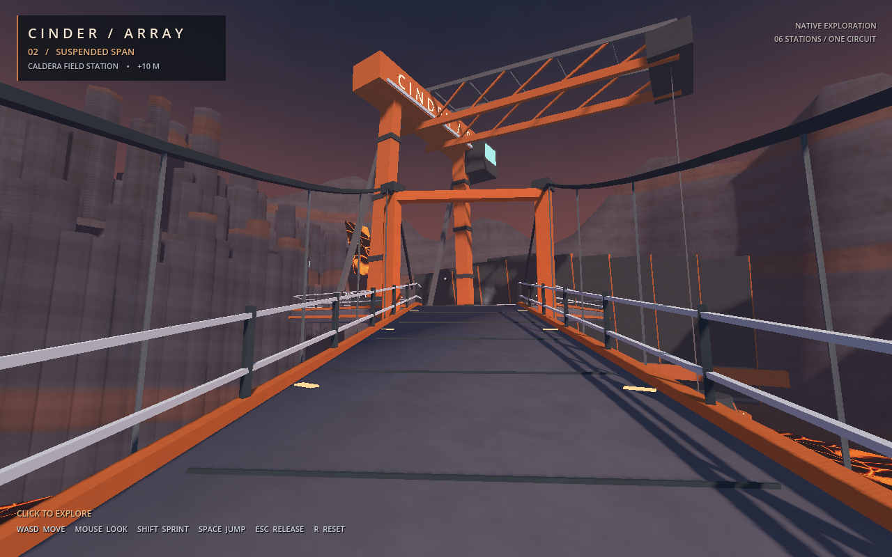

# Cinder Array — native caldera exploration

An additive Godot 4.5.2 Compatibility-renderer map, authored from native meshes, material-batched solids, convex collision, and Moth's existing baked resources.

- **Entry scene:** `res://cinder_array/demo.tscn`
- **Branch:** `graphics/cinder-map`
- **Base:** `7bfb473`



## The place

A suspended service span crosses an active volcanic caldera to a 31 m extractor gantry. Its cantilevered hoist lowers an extraction bell toward a moving crust-and-molten lake. The eastern cooling bank, lava cascade, iron-bearing cliff strata, and irregular hexagonal basalt fields establish the skyline.

The approximately 200 m circuit connects six named areas:

1. **Transfer deck**, +7 m: authored arrival view and service cabinet.
2. **Suspended span**, +7–12 m: ascending deck, cable pylons, hangers, undertruss, continuous safety barriers.
3. **Extractor gantry**, +12 m: open walk-through A-frame, crane cab, hoist, and cooling manifold.
4. **Basalt bore**, +12 m: 28 m enclosed, bevelled service tunnel with blue guide lights and native ceiling/wall collision.
5. **Rim observatory**, +16 m: canopy, survey instrument, bench, instrumentation console, and caldera overlook.
6. **Cooling traverse**, +12 m: western radiator stop and return ramp to the transfer deck.

The route closes in either direction. Paths are 5.2–7 m wide; the steepest finished ramp is **27.60°**. Level approaches connect each sloping run to its deck. Floor collision overlaps by 1.5 cm at internal profile seams; rendered tops abut without overlapping. Handrails have continuous 1.28 m-high native collision walls, rather than isolated post collision.

## Integration hooks

The lead can route `--experience=cinder-array` directly to `res://cinder_array/demo.tscn` in the native launcher. This branch owns only:

- `godot/cinder_array/`
- `godot/tests/cinder_array/`
- `port/native-cinder-array/`

`demo.gd` loads **`res://exploration/walker.gd` at runtime**. It expects the supplied `CharacterBody3D` contract:

```gdscript
var camera: Camera3D
func set_spawn(position: Vector3, yaw: float = 0.0, pitch: float = 0.0)
func reset_to_spawn()
```

The map sets FOV 76 and camera far distance 320 m. Spawn angles are radians. The walker and map are siblings under the identity-transform demo root; spawn and route positions use that authored coordinate space.

### Map API (`res://cinder_array/map.gd`)

| API | Result / behavior |
| --- | --- |
| `build()` | Idempotently constructs the map; `_ready()` already calls it. |
| `get_spawn()` | Caller-owned `{position, yaw, pitch}`; feet at `(-24, 7.06, 28)`. |
| `get_route_points()` | Caller-owned `Array[Vector3]`, 16 ordered floor positions including the repeated loop endpoint. |
| `get_location(position)` | Nearest named sector with `name`, `code`, and `point`. |
| `needs_respawn(position)` | Rejects nonfinite positions, y < 2 or > 85, |x| > 92, or |z| > 82. |
| `enforce_boundary(walker)` | Calls `reset_to_spawn()`, counts the reset, and returns whether it intervened. |
| `get_diagnostics()` | Geometry, collider, node, particle, renderer, and respawn counts. |
| `connection_point(connection, t)` | Evaluates a connector's finished level/ramp/level profile for review tooling. |

The compact HUD shows sector, elevation, and controls. Input belongs to the walker: click to capture, WASD/mouse, Shift sprint, Space jump, Escape release, R reset.

The inherited baseline has no shared exploration walker. Until the lead's controller is present, the default scene provides its authored camera and prints `CINDER_WALKER_PENDING`. For private development, **`--cinder-dev-walker`** explicitly loads the test-only compatible controller in the owned test directory. Final verification here uses that stand-in (radius 0.35, height 1.8, eye 1.6, speeds 6/10, 45° floor limit).

`--smoke` exits after 90 physics frames and prints `CINDER_SMOKE` JSON, including `walker_attached` and `camera_finite`.

## Reproduce

Commands are run from the repository root. `run.py` pins:

```
/home/mojo/.hermes-instances/fresh/workspace/godot-toolchain/Godot_v4.5.2-stable_linux.x86_64
```

It creates isolated HOME/XDG directories, forces `gl_compatibility`, and starts a private Xvfb with **`-nolisten tcp -nolisten unix`** for graphical runs. Mesa software rendering uses four llvmpipe threads. Engine errors are checked in addition to the process exit code; the runner preserves logs and enforces a 180-second subprocess timeout.

```bash
python3 port/native-cinder-array/run.py import --output /tmp/opencode/cinder-import
python3 port/native-cinder-array/run.py verify --output /tmp/opencode/cinder-physics
python3 port/native-cinder-array/run.py smoke --output /tmp/opencode/cinder-smoke
python3 port/native-cinder-array/run.py capture --size 1280x800 --output /tmp/opencode/cinder-1280
python3 port/native-cinder-array/run.py capture --size 960x640 --output /tmp/opencode/cinder-960
```

Interactive local review on a graphical display:

```bash
/home/mojo/.hermes-instances/fresh/workspace/godot-toolchain/Godot_v4.5.2-stable_linux.x86_64 \
  --path godot --rendering-method gl_compatibility \
  res://cinder_array/demo.tscn -- --cinder-dev-walker
```

After the shared walker lands, omit `--cinder-dev-walker` to exercise the integration path.

## Verification results

**[Final native physics report](evidence/final/physics/report.json): 1,244 assertions, zero failures.**

- 342 native ray probes cover connector centres and edge strips; floor heights match their render profiles.
- Capsule traverses all 16 route points forward at 6 m/s and reverse at 10 m/s using `move_and_slide()`. No waypoint teleports; **zero off-floor frames** in both complete circuits.
- Maximum waypoint height error is under 1 cm.
- Deliberate 10 m/s lateral motion is stopped by both bridge guardrails.
- Tunnel head clearance and native ceiling collision are checked independently of traversal.
- Four out-of-bounds positions restore the spawn and clear velocity; nonfinite boundary input is rejected.
- Material uniforms and authored geometry are finite; build is idempotent; nodes and colliders remain stable through traversal, particles, resets, and additional idle frames.
- **[Graphical scene smoke](evidence/final/smoke/godot.log)** exits cleanly with an attached private test walker.
- Fixed-camera GL captures, separated by at least 2.2 seconds, show molten movement in **6.27% / 6.28%** of sampled pixels at 1280 / 960. Threshold 4%; HUD and most static foreground remain unchanged.

### Actual map budget

| Item | Count |
| --- | ---: |
| Authored static triangles, including instantiated solids | 23,474 |
| Mesh / MultiMesh nodes | 91 |
| Material-batched solid instances | 1,180 |
| Native collision shapes on one static body | 103 |
| Map subtree nodes, including lights, labels, and particles | 216 |
| Lights | 1 shadowed directional + 3 unshadowed local |
| Ember particles | 48 total, three fixed emitters |
| Steam particles | 16 total, two fixed emitters |

Embers use small opaque low-poly meshes. Only the 16 small steam billboards use soft transparency; the lake, cascade, cliffs, and route surfaces are opaque. No particle spawning loop, scene growth, or density-lab machinery is involved.

### Rough software-renderer timings

Godot **4.5.2.stable.official.6ce3de25a**, Mesa **llvmpipe (LLVM 20.1.8, 256 bits)**, four software raster threads; 24 measured frame intervals after 12 warm-up intervals per view. Capture runs were serialized. Counts include the complete rendered frame, UI, and shadow passes.

| View | 960×640 median / p95 ms | 1280×800 median / p95 ms | 1280 draw calls |
| --- | ---: | ---: | ---: |
| Arrival eye | 44.39 / 51.10 | 55.49 / 59.35 | 230 |
| Span eye | 44.88 / 49.35 | 58.86 / 61.44 | 229 |
| Rim eye | 45.30 / 48.52 | 60.36 / 63.92 | 212 |
| Bore eye | 54.34 / 58.84 | 71.47 / 76.66 | 192 |
| Overview | 42.87 / 47.94 | 53.74 / 57.51 | 220 |

Rendered primitive counts at 1280 range from 53,476 to 73,304 across these views, including multiple rendering passes. These are rough llvmpipe observations, **not GPU hardware acceptance or a real-time performance guarantee**. Full metrics and camera positions are in the [1280 manifest](evidence/final/1280x800/manifest.json) and [960 manifest](evidence/final/960x640/manifest.json).

## Materials and rendering

Inspected the inherited Moth texture and extras contact sheets at `port/native-moth-graphics/evidence/run-cfg0z733/`. The near-black `rock` tile was unsuitable for this composition. The authored basalt instead uses desaturated `rock-moss`, with rough-stucco and brushed-metal families for the service structures.

- `opaque_surface.gdshader` receives the existing `Surfaces.create_surface(key, tint, false)` material data. Its private world-space sampler keeps Moth's baked albedo/normal resources and omits the source-map priority `DEPTH` write, allowing early depth rejection for these new opaque surfaces.
- `strata.gdshader` adds height-bent mineral bands and desaturated triplanar Moth rock to the carved cliff geometry.
- `molten.gdshader` warps moving cellular crust plates using the existing Moth flow/dust maps. Hot seams and melting pools remain readable without glow.
- `caldera_sky.gdshader` layers the inherited ashen panorama gently into a static dusk sky.
- Compatibility is the default. There is no glow, volumetric fog, screen-space reflection, or Forward+-only requirement.

## Reviewed images

The following **final** images were opened with the image read tool, at both 1280×800 and 960×640:

- [Arrival eye](evidence/final/1280x800/arrival-eye.png): offset bridge approach, extractor silhouette, molten foreground edge, and readable HUD.
- [Span eye](evidence/final/1280x800/span-eye.png): continuous ascending deck, cable suspension, open gantry throat, and cooling bank.
- [Rim eye](evidence/final/1280x800/rim-eye.png): unobstructed lake/hoist sightline above the safety rails.
- [Bore eye](evidence/final/1280x800/bore-eye.png): warm exterior / cool interior contrast and visible exit ramp.
- [Overview](evidence/final/1280x800/overview.png): connected circuit, enclosed caldera landform, cascade, and six-area composition.

Also opened and compared the final 1280 [molten A](evidence/final/1280x800/lava-motion-a.png) / [molten B](evidence/final/1280x800/lava-motion-b.png) pair. The 960 equivalents and metrics are retained with that resolution's evidence.

## Preserved iterations and limitations

The complete `attempt-01` through `attempt-05` evidence is retained:

- **01:** GDScript type-inference errors; the first capture incorrectly reached a completion marker after an engine error. The runner now rejects engine errors independently of exit status.
- **02:** The first complete renders exposed excessive brightness and a regular lava grid. Native traversal found genuine deck/ramp lips that stopped the capsule.
- **03:** A profile-helper type-inference error left both processes waiting until timeout; original logs are preserved.
- **04:** Level approaches fixed the lips. A moved console obstructed the route, and the elevated western ramps exceeded the project's more conservative 30° test budget.
- **05:** Full bidirectional traversal passed after relocating the console and lowering the rim deck to +16 m. A probe exactly on one collision seam still failed. The final 1.5 cm collider overlap resolved it without changing visible mesh joins.

The final shared exploration controller was absent in this baseline, so its integration remains the lead's verification step. This map is a native exploration showcase: no combat rules, campaign progression, Node session, or multiplayer behavior is implemented. Distant geology is scenic; walkable collision is concentrated on the authored loop, tunnel, barriers, and service props, with a reset boundary beneath the hot zone. The terrain and molten surface are deliberately stylized procedural art, and Compatibility shadow/texture aliasing remains visible at close range. Hardware GPU profiling has not been performed.
