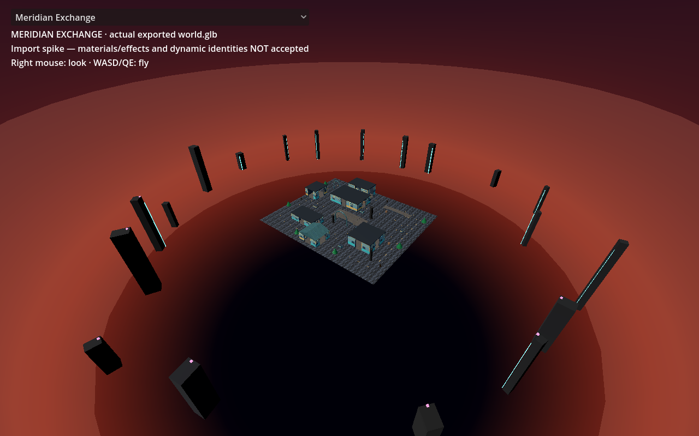

# GLB material-side export repair

**The diagnosed BackSide export loss is fixed in the export adapter.** The
historical native camera now sees Meridian's map instead of the opaque outside
of its sky sphere. All nine destination GLBs and the axis/weapon probe were
independently exported and imported with pinned Godot 4.5.2. This is a material
side/occlusion correction, **not original-art parity**.

Base: `c982d25ca335da3983df48ea37f7602bf8ded1f2`.
Worktree: `/tmp/opencode/cocs-glb-material-side`, branch `fix/glb-material-side`.
Source content pin: `51289b79c627a26a381ba556b92bab71f93f3732`.

## Adapter and API

`tools/godot-export/gltf_side.mjs` exports `normalizeGLTFSides(exportClone)`.
`harness.html` calls it **after** existing instance expansion and before the
standard GLTFExporter. The function returns `{policy, meshes, triangles}` in
`report.material_side`.

- A Three BackSide material cannot be expressed by glTF `doubleSided`: that
  would also expose the outside of the sky and retain the original occlusion.
- Affected meshes receive private geometry and material copies. Reverse each
  triangle, negate vertex/morph normals, convert material side to FrontSide.
  This produces inward-facing glTF front faces with ordinary native CULL_BACK.
- Preserve tangent XYZ and negate tangent W. Three r185's FLIP_SIDED negates N
  but retains T and B; glTF reconstructs `B = cross(N,T) * W`.
- Nonindexed geometry receives a reversed sequential index, preserving all
  vertex attribute associations. Indexed geometry swaps the last two indices
  per triangle. Positions, UVs, vertex colors, groups, ranges, morph positions,
  transforms and FrontSide/DoubleSide resources retain their semantics.
- Copies are local to each affected exported mesh, including meshes created
  by instance expansion. A FrontSide source mesh sharing the same geometry is
  untouched. Reapplying normalization is idempotent.
- Homogeneous BackSide material arrays are supported. Mixed-side arrays fail
  explicitly and require splitting. Unexpanded instances/batches, unaligned
  triangle ranges, BackSide shader materials, and object-space normal maps
  also fail explicitly rather than silently misrepresenting a surface.

The existing recognizable standard-material export adapter remains the
material translation. All ten executed exports report zero ShaderMaterials;
this change adds no shader-fidelity translation. Existing depth-write,
render-order, additive blending, camera-follow sky and shader limitations
remain visible in the exported scene.

`browser-export.mjs` adds optional `GLTF_REPORT_DIR` (default `port/reports`) so
private evidence can be written without replacing original diagnostics.

## Executed evidence

All four images below were opened and directly inspected with the image tool.

| Matched pair | Original | Repaired | Observation |
|---|---|---|---|
| Historical stock scene/camera `(110,125,140) → (0,0,0)` | [before](evidence/run-2/historical-before.png) | [after](evidence/run-2/historical-after.png) | Before: maroon gradient, map occluded. After: ground, buildings, arches, trees and outer skyline visible. |
| Current stock viewer from this base `(65,48,70) → (0,2,0)` | [before](evidence/run-2/current-before.png) | [after](evidence/run-2/current-after.png) | Current camera is already inside the sky: map visible in both; repaired inward sky/haze now appears. |



For the historical pair, the private project uses the **unaltered** viewer
file from `70e9075dfb93a5cc25be8229d362d0e9f9a66835`; its baseline PNG is
byte-identical to `port/reports/meridian-glb.png`. Each pair changes only the
GLB. Current stock viewer bytes are copied from this base. No custom renderer,
camera adjustment, scene-node hiding, native material override or culling hack
is used by either pair. Both viewers retain their own lighting/environment.

Source conditions: the unchanged harness calls `configureMothAssets()` and
`ArenaView.buildArena(map)`, exporting `worldGroup`. Source default
`addSky(...radius=185...)` and its haze child are present. No requested alternate
sky, custom scene, runtime camera-follow update or gameplay session is injected.

The repaired images still show conspicuous hard sky/haze bands; current stock
lighting/fog also changes the appearance relative to the historical viewer.
No matching live browser art reference or art acceptance is claimed.

### Structural and numerical checks

- [Unit log](evidence/run-2/unit.log): **6/6 pass**, covering indexed/nonindexed
  clone isolation with shared FrontSide/DoubleSide geometry, attribute/morph
  preservation, tangent basis, expanded-instance resource isolation, inward
  closed-sphere winding, homogeneous groups, and explicit unsupported cases.
- [Existing native import gate](evidence/run-2/import-existing.log): axis
  position, expanded instance and Meridian import pass.
- [New native import gate](evidence/run-2/import-sides.log): **9/9 maps**, each
  with 2,976 inward sky triangles, inward normals and ordinary CULL_BACK.
- Every destination report in [exports](evidence/run-2/exports) records **two
  converted meshes / 3,488 triangles**: sky 2,976 plus haze 512. Axis probe
  records zero affected meshes. All nine maps were rebuilt because the common
  adapter affects every map's BackSide sky/haze.
- [Logical GLB comparison](evidence/run-2/logical-glb-comparison.json): Meridian
  changes exactly **four accessors** (sky/haze indices and normals). The other
  **243 accessors**, all **30 embedded images**, materials, scene hierarchy,
  transforms, positions, UVs and colors are identical. Normals are exact
  negations and triangle indices exact reversals. No global culling change.
- [Raster support](evidence/run-2/image-analysis.json): below the fixed UI,
  historical unique colors increase **160 → 3,687**; **870,343 / 870,400** pixels
  change. This supports the directly observed empty/nonempty difference; it
  does not measure foreground segmentation or visual fidelity. Current pair
  has **5,475 → 10,581** colors and **835,603** changed pixels.
- [Run record](evidence/run-2/run.json): SHA-256 for **1,057 source/dependency/
  contract files before and after match**. `verifySource` ran through each
  exporter without modification. No full repository verifier was run.
- Private Xvfb uses `-nolisten tcp -nolisten unix`; all recorded owned command
  groups are absent after cleanup. Only loopback export Vite/browser processes
  and private native processes were started. No shared server/desktop restart.

### Failures and reproducibility boundary

The first verifier attempt failed its preflight historical GLB byte-hash check;
[failure record](evidence/run-1/preflight-failure.txt) is preserved. Fresh
unmodified export has the same logical resources as the historical GLB but a
different asynchronous embedded-image buffer order. All **247 accessors and
30 image byte payloads** compare equal via their logical references. Whole-file
GLB byte determinism is therefore **not established** by this work.

Meridian GLB hashes (all 2,060,200 bytes):

| Input | SHA-256 |
|---|---|
| Historical | `a41094bdbafd7a6796d86d175982aab958e3500e8d8514f820dfa36c362d73ea` |
| Fresh unmodified harness | `241fb1bdb06e6edebdebd1e482fbf4ab7d71ea1850e448a5abb6fa6222900606` |
| Repaired export | `f777aeb151e4724758742dcc9d15e7d94e47e7cc80bfaf4948b4dc770844e0e7` |

The baseline export log retains the favicon 404, existing material/texture
translation warnings and SwiftShader performance warning. Native graphical
logs retain the software-driver VSync warning. Completed import/capture logs
contain no script errors. Evidence `run.json` was produced before adding the
two analysis commands to the runner; those commands were executed separately
and their outputs/owned-process record are retained alongside it. The final
runner executes these checks automatically in future fresh runs.

## Reproduction

Use existing dependencies read-only through a symlink. No installs required.
Pinned engine: `/home/mojo/.hermes-instances/fresh/workspace/godot-toolchain/Godot_v4.5.2-stable_linux.x86_64`.
Chromium used: `/tmp/opencode/cocs-native-ci-state/browsers/chromium-1187/chrome-linux/chrome`.

First create an original input from the unmodified adapter in a **fresh private
baseline worktree**. Copy only the report-output-capable CLI from this repair;
the baseline harness remains the committed original:

```sh
git worktree add --detach /tmp/opencode/glb-side-baseline c982d25
ln -s /home/mojo/.hermes-instances/fresh/workspace/cocs-godot-port/node_modules /tmp/opencode/glb-side-baseline/node_modules
cp tools/godot-export/browser-export.mjs /tmp/opencode/glb-side-baseline/tools/godot-export/browser-export.mjs
# Run the next command with cwd=/tmp/opencode/glb-side-baseline:
GLTF_REPORT_DIR=/tmp/opencode/glb-side-baseline-report \
CHROMIUM_PATH=/tmp/opencode/cocs-native-ci-state/browsers/chromium-1187/chrome-linux/chrome \
node tools/godot-export/browser-export.mjs meridian-exchange
```

Then from the repaired worktree (choose a **new** output directory):

```sh
python3 -B port/native-glb-side/verify.py \
  --output /tmp/opencode/glb-side-recheck \
  --original-glb /tmp/opencode/glb-side-baseline/godot/content/probes/meridian-exchange/world.glb \
  --chromium /tmp/opencode/cocs-native-ci-state/browsers/chromium-1187/chrome-linux/chrome
```

This runs focused tests, semantic generation, ten independent browser exports,
both headless imports, logical GLB checks, four matched captures and image
analysis. Generated GLBs stay ignored. The fresh baseline used for the saved
run is retained at `/tmp/opencode/glb-side-original/world.glb` on this host.

Focused checks can be rerun directly:

```sh
node --test tools/godot-export/gltf_side.test.mjs
python3 -B port/native-glb-side/analyze.py \
  --before /tmp/opencode/glb-side-original/world.glb \
  --after godot/content/probes/meridian-exchange/world.glb
```

## Scope and integration handoff

Only the export adapter, its optional report destination, new focused tests
and this evidence directory are changed. Original shared reports, locked
source/assets/contracts, dependencies and native viewer/runtime are untouched.
The lead must regenerate ignored GLBs after integrating the scoped commits;
this branch does not include binaries or update shared release/parity gates.
Technical export success establishes no asset redistribution permission.
No merge, push, deployment, or reserved preview-path changes were performed.
